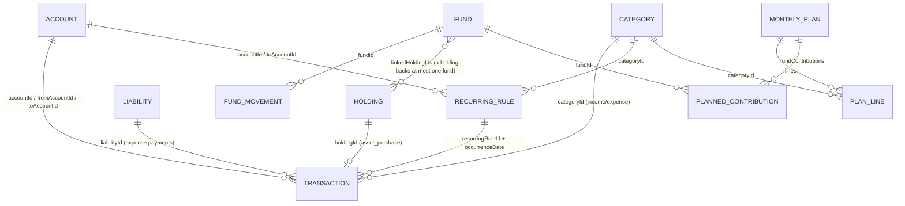

# Wealth — Technical Documentation

> Written from the code as of persisted-state **version 6** (`store/migrations.ts → CURRENT_VERSION`).
> Examples use the fake data in `store/seed.example.ts`. **Never copy figures from
> `store/seed.local.ts` (the owner's real data) into docs, tests or issues.**

---

## 1. Overview

Wealth is a **single-user, local-first, offline** personal-finance app (Expo / React Native,
Arabic UI, right-aligned). All data lives on the device in AsyncStorage; there is no server,
no login and no network dependency for any feature. The only network use is optional:
EAS Update (over-the-air JS updates) and the OS share sheet when exporting a backup. Due
reminders are *local* notifications scheduled on the device (no push server).

Product idea: **"every pound has a job"** (zero-based budgeting). Money sits in *accounts*
(cash/bank/wallet, in EGP/SAR/USD, located in Egypt or Saudi Arabia); savings goals are
*funds* that earmark cash and/or linked gold; a *monthly plan* gives every unit of expected
income a job; *safe to spend* tells the user what's left on flexible budget lines.

Multi-currency: amounts are stored in their own currency; totals are shown in EGP (net worth)
or in the plan currency (default SAR). Every transaction snapshots its exchange rate
(`rateToEGP`) so history doesn't change when rates change.

Islamic-finance constraint: the model deliberately has **no interest/APR fields** anywhere.

---

## 2. Tech stack (resolved versions from `package.json` / `node_modules`)

| Area | Package | Version |
|---|---|---|
| Framework | `expo` | 57.0.26 (SDK 57) |
| Runtime | `react-native` | 0.86.3 (New Architecture, Hermes) |
| UI lib | `react` / `react-dom` | 19.2.3 (React Compiler enabled in `app.json`) |
| Web | `react-native-web` | 0.21.2 |
| Navigation | `expo-router` | 57.0.24 (file-based, typed routes; React Navigation is vendored inside expo-router) |
| State | `zustand` (+ `persist` middleware) | 5.0.15 |
| Storage | `@react-native-async-storage/async-storage` | 2.2.0 |
| Crypto (backups) | `@noble/ciphers` / `@noble/hashes` | 2.4.0 / 2.4.0 (pure JS, ESM) |
| Random / UUID | `expo-crypto` | 57.0.3 (`randomUUID`, `getRandomBytes`) |
| Files | `expo-file-system` / `expo-sharing` / `expo-document-picker` | 57.0.7 / 57.0.22 / 57.0.3 |
| App lock | `expo-local-authentication` | 57.0.3 |
| OTA updates | `expo-updates` | 57.0.24 |
| Local notifications | `expo-notifications` | 57.0.21 (due reminders; native module, needs a build) |
| Date picker | `@react-native-community/datetimepicker` | 9.1.0 (native only; web uses `<input type="date">`) |
| Animations | `react-native-reanimated` / `react-native-worklets` | 4.5.1 / 0.10.1 |
| Language | `typescript` | 6.0.3 (`strict`) |
| Tests | `tsx` + `node:test` | 4.23.15 / Node 22 |
| Lint | `eslint` + `eslint-config-expo` | 9.x / 57.0.2 |

Other Expo modules present: `expo-constants`, `expo-font`, `expo-haptics`, `expo-image`,
`expo-linking`, `expo-splash-screen`, `expo-status-bar`, `expo-symbols`, `expo-system-ui`,
`expo-web-browser`, `react-native-gesture-handler`, `react-native-safe-area-context`,
`react-native-screens`.

---

## 3. How to run

```bash
npm install
npx expo start            # scan the QR with Expo Go (SDK 57) on Android/iOS
npx expo start --web      # web build (single-page output; no server rendering)
npm run test:logic        # pure-logic test suite (node:test via tsx)
npm run lint              # expo lint
npx tsc --noEmit          # type check (must be 0 errors)
npx expo-doctor           # dependency/config health (must pass)
```

Notes:
- Typed routes live in `.expo/types/router.d.ts` and are regenerated by `expo start`
  (git-ignored). If you add a route and `tsc` complains about an unknown href, run the dev
  server once.
- Expo Go limitations: Face ID is not available in Expo Go on iOS (fingerprint / device PIN
  work); `expo-updates` values are `null` in Expo Go. Local notifications (due reminders) work in
  Expo Go; only remote push would need a development build.
- First launch seeds data from `store/seed.local.ts` if present (git-ignored), otherwise from
  `store/seed.example.ts`.

---

## 4. Folder structure

```
app/                        expo-router routes
  _layout.tsx               Root Stack: (tabs), fund/[id], settings, recurring, due, categories;
                            mounts <RecurringRunner/> and <AppLockGate/>
  (tabs)/_layout.tsx        Bottom tabs (order): index, transactions, plan, assets, goals
  (tabs)/index.tsx          الرئيسية — dashboard
  (tabs)/transactions.tsx   المعاملات — month list grouped by day
  (tabs)/plan.tsx           الخطة — monthly plan
  (tabs)/assets.tsx         الأصول — accounts & holdings
  (tabs)/goals.tsx          الصناديق — funds
  fund/[id].tsx             Fund detail (stack)
  settings.tsx              Settings (stack)
  recurring.tsx             المعاملات المتكررة — rules list (stack)
  due.tsx                   المستحقات — due inbox (stack)
  categories.tsx            البنود — category management (stack)

components/
  AppLockGate.tsx           Biometric/PIN lock overlay (Modal)
  RecurringRunner.tsx       Invisible: processDue after hydration / on foreground; syncs reminders
  assets/EditAccountSheet   Edit account name + "current balance"
  categories/CategorySheet  Add / edit / archive / restore / delete a category
  dashboard/                SafeToSpendCard, MonthlySnapshot, RecurringCard (جاي قريب),
                            NetWorthCard, BackupReminder, homeInsights.ts (pure Home logic)
  funds/                    FundCard, FundSheet (create/edit), AssignSheet (وزّعها),
                            CoverSheet (غطّيها), MoveMoneySheet (إضافة/سحب),
                            PaySinkingSheet (اتدفعت), UnassignedPanel, labels.ts
  plan/PlanEditorSheet      Edit a month's plan (lines are tappable rows)
  plan/AddLineSheet         "أضف بند": من الموجود (search, by bucket) / بند جديد
  plan/LineSheet            One line: limit, ثابت/مرن, "نقل لـ" bucket, شيل من الخطة
  plan/labels.ts            BUCKET_TITLES, KIND_OPTIONS
  recurring/                RuleSheet (add/edit/delete rule), ConfirmOccurrenceSheet (تم),
                            labels.ts (Arabic frequency / mode / section labels)
  settings/                 ExportSheet, RestoreSheet
  transactions/             TransactionRow (shared row), TransactionSheet (add/edit) and its
                            presentational parts CategoryPicker, AccountPicker, GoldFields,
                            MoreDetails; transactionUi.ts (pure: FILTERS, filterTransactions,
                            emptyFilterMessage, quickCategories, transferTitle)
  ui/                       Design-system primitives: AppText, Card, Button, Chip/ChipRow,
                            StatusChip, Segment, ProgressBar, Money, AmountInput, FormField,
                            ListRow/ListGroup, SectionHeader, InsightCard, EmptyState;
                            Screen (outer layout + safe area), Fab,
                            DateFields (Past/Future), DatePicker(.web), FormSheet/FieldLabel/
                            FormInput, LoadingView, MonthSwitcher, ProgressBar, Segment,
                            StatCard, icon-symbol(.ios), CurrencyText

store/                      ALL business logic lives here (pure, no React)
  types.ts                  Data model
  selectors.ts              Derived figures (balances, net worth, funds, month summary…)
  planning.ts               Monthly plan math (suggestion, progress, safe to spend…)
  recurring.ts              Recurring schedule engine (occurrences, due, upcoming, reminders)
  operations.ts             Validated state transitions → patches; sync bookkeeping
  errors.ts                 FinanceValidationError + typed codes
  migrations.ts             v0 → v6 migration chain
  backup.ts                 Backup file format, AES-GCM/PBKDF2, open/validate/preview
  defaultCategories.ts      20 default categories (stable ids), FIXED_CATEGORY_IDS
  useFinanceStore.ts        Zustand store + persist config (the only RN-aware store file)
  seed.example.ts           Committed fake seed
  seed.local.ts             Owner's real opening position (git-ignored, EAS-uploaded)

utils/
  currency.ts               rateToEGP / toEGP / fromEGP
  dates.ts                  date keys, month keys, shiftMonth, monthsUntil, addMonthsToDate
  formatters.ts             formatCurrency, formatDate, formatDayLabel, formatMonthLabel
  parseAmount.ts            Arabic/Western digits, separators → number
  errorMessages.ts          Error code → Arabic text (single place)
  runAction.ts              try action → show Arabic error
  dialogs(.web).ts          confirmAction / showMessage (Alert vs window.confirm/alert)
  backupFiles(.web).ts      Save (share sheet / download) and pick backup files
  appLock(.web).ts          Lock availability + authenticate
  appInfo(.web).ts          App version / runtime / channel / update id
  notifications(.web).ts    Local due reminders (permission, channel, schedule/cancel); web no-ops
  id.ts                     newId() = expo-crypto randomUUID

constants/                  theme.ts (design tokens), currencies.ts (DEFAULT_RATES), market.ts
tests/logic.test.ts         126 tests over store/* and utils/*
docs/                       This file, USER_GUIDE.md, CHANGELOG.md
app.json / eas.json         Expo + EAS config
.easignore                  EAS upload filter (keeps store/seed.local.ts)
```

---

## 5. Navigation

Root `Stack` (`app/_layout.tsx`): `(tabs)` (no header), `fund/[id]` (title "الصندوق", replaced by
the fund name; back "رجوع"),
`settings` (title "الإعدادات"), `recurring` ("المعاملات المتكررة"), `due` ("المستحقات"),
`categories` ("البنود").
`<RecurringRunner/>` (renders nothing) and `<AppLockGate/>` sit above everything.
`<StatusBar style="dark" />` (light theme only, dark icons on the light background).

### Layout & safe-area conventions

Edge-to-edge is always on (SDK 57 / RN 0.86): every screen and modal is drawn under the status
bar and the Android navigation bar, so insets must be handled explicitly. Rules:

- **`components/ui/Screen.tsx` is the only way a route sets its outer layout.** Props: `scroll`,
  `edges` (`'top' | 'bottom'`, default `['top']`), `contentStyle`, `refreshControl`, `header`
  (fixed above the content), `overlay` (absolute layer, e.g. a Fab). It uses
  `useSafeAreaInsets()` from `react-native-safe-area-context` (never React Native's
  `SafeAreaView`): `'top'` → `paddingTop = insets.top + 8` on the outer view (so scrolled content
  never slides under the status bar); `'bottom'` → `paddingBottom = insets.bottom + 16` on the
  scroll content (or the inner view when not scrolling). Background = `Colors.light.background`.
- **Tab screens** (`headerShown: false`): `edges={['top']}`; their own header row (e.g. the gear
  on الرئيسية) is part of the content, so it sits below `insets.top`. No `'bottom'` edge — the tab
  bar sits below the screen and already reserves `insets.bottom`.
- **Stack screens** always use the **native header** (Arabic title set in `app/_layout.tsx`, back
  "رجوع"; `fund/[id]` sets its title and "تعديل" button with `<Stack.Screen options>`). The header
  handles the top inset, so they use `edges={['bottom']}` — no top padding (no double inset), and
  the end of the content stays above the navigation bar / home indicator. No custom headers.
- **Floating "+" buttons:** `components/ui/Fab.tsx`, rendered in `<Screen overlay>`.
  `placement="tab"` → `bottom: 20` (the screen already ends at the tab bar, which includes
  `insets.bottom`); `placement="stack"` → `bottom: insets.bottom + 20`. Lists under a Fab end with
  `paddingBottom: FAB_CLEARANCE` (92) so the last row isn't covered.
- **Sheets:** every `*Sheet` is built on `FormSheet` (`Modal`, `presentationStyle="pageSheet"`,
  `statusBarTranslucent` + `navigationBarTranslucent`). `useSheetInsets()`: on Android the modal is
  a full-height window, so the header is padded by `insets.top`; on iOS the page sheet already
  starts below the status bar (top 0). The body always gets `paddingBottom: insets.bottom + 40`,
  so the last field or button scrolls clear of the navigation bar / home indicator.
- **AppLockGate:** full-screen, translucent `Modal`; content centred inside the safe area
  (padding = all four insets).
- Don't add hard-coded top paddings to compensate for the status bar (e.g. `paddingTop: 40`).
  On web all insets are 0.

| Route | Tab title | What it does |
|---|---|---|
| `/` (`index`) | الرئيسية | Calm Wealth Home (see "Home" below): greeting + date + settings icon; safe to spend (hero) → /plan; one next-best-action insight; هذا الشهر snapshot → /transactions; جاي قريب → /recurring, /due; up to 3 funds → /fund/[id], "عرض كل الصناديق" → /goals; money available to plan (Assign/Cover sheets); net worth; backup nudge → /settings?export=1; last 5 transactions (tap to edit, "+ معاملة"). |
| `/transactions` | المعاملات | MonthSwitcher; MonthlySnapshot for the selected month (no link); filter chips الكل/مصروف/دخل/تحويل/ذهب (UI-only, by type); days (FlatList), each a header row (day label · day net in textSecondary, never red) and one ListGroup of TransactionRows (tap → edit); EmptyState for an empty month, a one-line message for a filter with no match; "+" FAB → TransactionSheet. |
| `/plan` | الخطة | Month switcher; empty state (اقترح من مصروفي / انسخ خطة … / ابدأ من الصفر); income + unplanned header; lines by bucket with progress; fund contributions vs allocated; off-plan spending; planned/spent/remaining summary; "تعديل" → PlanEditorSheet (tap a line → LineSheet; "+ أضف بند" → AddLineSheet, whose "إدارة البنود" asks to discard unsaved edits, closes the editor and opens `/categories`); "المعاملات المتكررة ‹" link → `/recurring`. |
| `/assets` | الأصول | Summary (إجمالي الأصول / السيولة / الاستثمارات); accounts (tap → EditAccountSheet, delete); holdings with P&L (delete); "+" → add account (cash/bank/wallet) or gold (opening asset). |
| `/goals` | الصناديق | UnassignedPanel; sections الطوارئ / الأهداف / مصاريف دورية (by priority); emergency empty hint; "+" → FundSheet. |
| `/fund/[id]` | (stack) | Fund summary (progress, status, due date, months left, required monthly, cash), إضافة / سحب, اتدفعت (sinking), linked gold, movement history; header "تعديل" → FundSheet (edit/delete). |
| `/settings` | (stack) | Exchange rates, gold prices (24k/21k, 18k derived), tracking start, save; backups (export/restore, last backup); البنود ("إدارة البنود" → `/categories`); المعاملات المتكررة (link to `/recurring`, "تنبيهات المستحقات" switch, off by default, disabled on web); app lock toggle; "استيراد البيانات الافتتاحية"; version/runtime/update line. `?export=1` opens the export sheet. |
| `/recurring` | (stack) | "جاي خلال 30 يوم" (up to 12 items + income/expense totals per currency); sections دخل / مصروفات / تحويلات; each rule shows mode badge (تلقائي / بتأكيد), amount ("تقريباً" if variable), Arabic frequency, account(s), next date / متوقف / انتهى, and a pause/resume switch; tap → RuleSheet (edit/delete); "+" FAB → RuleSheet (new). |
| `/due` | (stack) | Due inbox for `confirm` rules: "فات ومتسجلش" (missed, earlier months) listed first, then "المستحق الشهر ده", each oldest first with a count; each item has **تم** (ConfirmOccurrenceSheet: amount, received amount for cross-currency transfers, account, date, note) and **تخطّي**. |
| `/categories` | (stack) | Sections مصروفات (by bucket: أساسيات / رفاهيات / عطاء) and دخل with active categories ("أساسي" badge on defaults), then مؤرشفة; tap → CategorySheet (rename; bucket for expenses; أرشفة / استرجاع / حذف); "+" FAB → CategorySheet (name, مصروف/دخل, bucket required for expenses). |

### Design system (Calm Wealth)

Phase 1 of the Calm Wealth redesign: tokens + shared primitives. Screens are migrated in later
phases; until then they keep using the deprecated aliases below.

**Tokens (`constants/theme.ts`)** — components read these, never raw hex.
- `palette.light` → `colors` (type `ThemeColors`, keys = `ColorToken`); `colors` is the single
  switch point for a future dark palette. Grounds: `background` #F8F7F3, `surface` #FFFFFF,
  `surfaceSubtle`, `border`, `borderStrong`, `progressTrack`. Text: `text`, `textSecondary`,
  `textMuted` (placeholders/disabled only — fails 4.5:1). Brand green `primary900…primary50`,
  `onPrimary`. Gold: `gold`, `goldSurface`, `goldText`. States: `warning`/`warningSurface`,
  `danger`/`dangerSurface`. `scrim`.
- `space` xs 4 · sm 8 · md 12 · lg 16 · xl 20 · xxl 24 · xxxl 32 · huge 40.
- `radius` sm 8 · md 12 · lg 16 · xl 24 · pill 999.
- `type` (alias `typography`; keys = `TypeVariant`): moneyHero 34/44, moneyLg 24/32, moneyMd
  18/26, moneyRow 16/24, display 32/42, titleLg 26/36, title 22/30, section 18/26, body 16/26,
  bodyStrong 16/26 600, secondary 14/22, caption 13/20, micro 12/18. Money styles are rendered
  with `fontVariant: ['tabular-nums']`.
- `shadow.card`, `shadow.raised`; `opacity` pressed 0.85 / disabled 0.4; `size` touchMin 44,
  fab 56, icon 24, progress 8. System fonts only; icons = MaterialIcons (+ `IconSymbol`).
- **Deprecated aliases** (`Colors`, `FinanceColors`, `Fonts`), removed in phase 7:
  `Colors.light.text/background` → text/background, `tint`/`tabIconSelected` → primary700,
  `icon`/`tabIconDefault` → textSecondary, `Colors.dark` = light; `FinanceColors.primary/income` →
  primary700, `expense` → danger, `gold` → gold, `progressTrack`, `cardBackground` → surfaceSubtle.
  They stay 6-digit hex because old call sites append alpha suffixes (`tint + '22'`).

**RTL approach (one rule everywhere).** The app never enables `I18nManager` RTL (Expo's
`supportsRTL` is off), so the layout engine is always LTR and Arabic is laid out explicitly:
rows that read right-to-left use `flexDirection: 'row-reverse'` (first child = rightmost =
reading start), text uses `textAlign: 'right'` + `writingDirection: 'rtl'` (AppText default),
progress fills from the right, and "forward" chevrons point left (`chevron-left`). Money is
wrapped in a left-to-right isolate (U+2066…U+2069) so "ر.س 1,250" and its sign never get
reordered inside Arabic text. Inputs of numbers stay LTR (AmountInput).

**Primitives (`components/ui/`)** — each reads only tokens.

| Component | Props | Notes |
|---|---|---|
| `AppText` | `variant` (TypeVariant, default body), `color` (ColorToken, default text), `align` (default right), + Text props | Base of all primitives |
| `Card` | `variant` default \| subtle \| hero, `style` | default: surface, 1px border, radius.lg, padding lg, shadow.card · subtle: surfaceSubtle, flat · hero: radius.xl, padding xl |
| `Button` | `label`, `onPress`, `variant` primary \| secondary \| tertiary \| destructive, `icon?`, `disabled`, `loading`, `block` | minHeight 48, radius.md; primary pressed → primary900 |
| `Chip` / `ChipRow` | `label`, `selected`, `disabled`, `onPress` | pill, minHeight 36 + hitSlop → 44; selected primary50 / primary700 border / primary800 semibold |
| `StatusChip` | `label` (required), `tone` ok \| attention \| danger \| gold \| neutral, `icon?` | Status never by color alone |
| `Segment` | `options`, `value` (may be undefined), `onChange` | Track surfaceSubtle, active surface + shadow.card + primary800 bold |
| `ProgressBar` | `progress`, `tone` normal \| attention \| over, `goldPortion?`, `height` (+ deprecated `color`, `backgroundColor`) | Fills primary600 / warning / danger; gold part first |
| `Money` (+ `formatMoney` in pure `formatMoney.ts`) | `amount`, `currency`, `size` hero \| lg \| md \| row, `tone` default \| positive \| danger \| muted, `showSign?`, `converted?` {amount, currency}, `align` | Never colored by sign; tabular nums; `LRI` + symbol + `LRM` + sign + number + `PDI` (the LRM keeps "−1,250" together: digits after the Arabic symbol would otherwise resolve as Arabic numbers and the minus would jump to their right) |
| `AmountInput` | `value`, `onChangeText`, `onChangeAmount?` (parseAmount), `currency`, `hint?` {tone neutral \| attention, text}, `allowZero`, `autoFocus` | 48 (40 when long) bold, centred |
| `FormField` | `label`, `helper?`, `error?`, children (input) | Error: danger border + dangerSurface + icon + text. `FormInput`/`FieldLabel` in FormSheet share the look: borderStrong, radius.md, minHeight 48, body, placeholder textMuted |
| `ListRow` / `ListGroup` | `title`, `subtitle?`, `icon?`, `iconTone` neutral \| ok \| gold, `trailing?`, `chevron?`, `archived?`, `onPress?` | 36px icon tile, minHeight 56; group = surface, radius.lg, border, hairline separators |
| `SectionHeader` | `title`, `actionLabel?`, `onAction?` | section type + tertiary action |
| `InsightCard` | `tone` ok \| attention \| danger, `message`, `icon?`, `actionLabel?`, `onAction?` | Grounds primary50 / warningSurface / dangerSurface |
| `EmptyState` | `icon`, `title`, `body?`, `actionLabel?`, `onAction?` | Icon disc + primary Button |
| `Fab` | unchanged API (`placement`, `FAB_CLEARANCE`) | primary700, pill, shadow.raised |
| `FormSheet` | unchanged API (`useSheetInsets`) | background ground, hairline header, title 18 bold, cancel textSecondary, save primary700 |
| `Screen` | unchanged | background = colors.background |
| `StatCard`, `CurrencyText`, `LoadingView`, `MonthSwitcher` | unchanged (StatCard `accentColor` now ignored) | Tokens; StatCard is a plain metric tile |

Pure date helper: `components/ui/formatDateAr.ts` → `formatDateAr(dateKey|iso, {year})` ("٥ أكتوبر ٢٠٢٦");
used by redesigned components instead of `utils/formatters.formatDate` (which prints English
month names).

### Navigation theme & tab bar (Calm Wealth phase 2)

- `app/_layout.tsx` passes a light React Navigation theme built from tokens (`background` and
  `card` = colors.background, `text`, `border`, `primary` = primary700); the color-scheme hook is
  no longer used (light only). Header titles and back behavior unchanged.
- `app/(tabs)/_layout.tsx`: same 5 tabs, order and `HapticTab`; bar on colors.background, hairline
  top border, no elevation/shadow; active primary700, inactive textSecondary; labels
  `type.micro` size/weight (no fixed lineHeight — it clipped Arabic glyphs); icons 24
  (`size.icon`). Web only: bar height 58 + bottom padding 6 (web has no bottom inset and the
  default 48px clipped the labels' descent).
- Icons (`components/ui/icon-symbol.tsx` mapping, SF Symbol → Material): house.fill → home,
  list.bullet.rectangle → receipt-long, calendar → event-note, wallet.pass →
  account-balance-wallet, target → track-changes.

### Home (Calm Wealth phase 2)

One question: *what should I know / do now?* Daily decisions first, long-term figures after.
Content padding `space.lg`, section gap `space.xxl`. Order (`app/(tabs)/index.tsx`):

1. **Header** — "صباح الخير" (before 12:00) / "مساء الخير", ar-EG date without year,
   settings icon button (textSecondary, 44pt, label "الإعدادات").
2. **SafeToSpendCard** (hero) — `safeToSpend` in the plan currency (Money hero, text color),
   "حتى نهاية الشهر · حوالي {safeToSpendToday} يومياً", StatusChip ok "خطتك ماشية كويس" or
   attention "في بند محتاج انتباه" + "صرف {lines} عدى الخطة" (`overspentLines`). No plan →
   explanation + primary "اعمل خطة الشهر" → /plan (never a 0). Tap → /plan.
3. **Next best action** — at most one `InsightCard` from `nextBestAction` (table below); nothing
   when null. When null and a backup is due, the backup nudge takes this slot.
4. **MonthlySnapshot** — "هذا الشهر": دخل / مصروف / صافي from `monthSummary` (EGP) in one
   grouped surface; expense in text color; net positive (+) green, negative "−" plain. Tap or
   "كل المعاملات" → /transactions. Replaces the three StatCards (StatCard is still used by the
   Transactions and Assets tabs).
5. **جاي قريب** (`RecurringCard`) — up to 3 `upcomingItems` as ListRows (name, day label or "بعد
   N أيام", amount; income rows green tile). Header action "الكل" → /recurring; a calm warning
   link "عندك N … · راجعهم" → /due when confirm items are due and the insight isn't already
   about them. Hidden without content.
6. **الصناديق** — up to 3 `homeFunds` as FundCards; "عرض كل الصناديق" → /goals; subtle hint when
   there are none.
7. **UnassignedPanel** — positive: "فلوس متاحة للتخطيط" + "وزّع أموالك" (AssignSheet); negative:
   dangerSurface card "استخدمت جزء من فلوس الصناديق." + "غطّي الفرق" (CoverSheet) — the only
   danger styling on Home; zero: nothing. Hidden when the insight is `cover`/`assign`.
8. **NetWorthCard** — "صافي الثروة" (Money lg), مصر / السعودية lines (`netWorthByLocation`),
   سيولة / ذهب واستثمارات (gold dot) on a subtle strip.
9. **BackupReminder** — InsightCard attention "يفضل تعمل نسخة احتياطية…" + "تصدير نسخة" →
   /settings?export=1; same 7-day rule (`needsBackupReminder`); here only when an insight took
   the top slot.
10. **آخر المعاملات** — 5 `recentTransactions` in a ListGroup of TransactionRows ("+ معاملة" opens
    TransactionSheet; tap a row to edit); EmptyState "لسه مسجلتش معاملات." + "سجّل معاملة".

**`components/dashboard/homeInsights.ts`** (pure; unit-tested) — `nextBestAction(state, now)`:

| # | Condition | Tone | Message | Action |
|---|---|---|---|---|
| 1 | `unassignedEGP < −0.005` | danger | استخدمت جزء من فلوس الصناديق. | غطّي الفرق → CoverSheet |
| 2 | `dueOccurrences(today, 'confirm')` not empty | attention | عندك {N: مستحق واحد / مستحقين / N مستحقات / N مستحق} محتاج… مراجعة. | راجعهم → /due |
| 3 | first of `upcoming(3 days)` | attention | {name} مستحق خلال {يوم / يومين / N أيام}. | راجع المستحقات → /recurring |
| 4 | first fund (priority order) with `fundStatus = behind` and `fundRequiredMonthly > 0` | attention | {fund} محتاج {amount} هذا الشهر عشان يفضل على المسار. | خصص الآن → /fund/[id] |
| 5 | `unassignedEGP > 0.005` | ok | عندك {amount} لسه محتاجة تتوزع. | وزّع أموالك → AssignSheet |
| — | otherwise | | null | |

`homeFunds(state, now, max = 3)`: behind first, then nearest due date (funds with a due date
before those without), then `fundsByPriority` order. `upcomingItems(state, now, max = 3)`: the
first items of `upcoming(30 days)`. Helpers `dueCountPhrase`, `withinDaysPhrase`, `daysBetween`.

**FundCard** (Home and the Funds tab): name (bodyStrong) + StatusChip · "{current} من {target}" ·
ProgressBar (attention when behind; `goldPortion = fundLinkedValue / target`) · one sentence +
percent · "الموعد: …". Status mapping (`components/funds/labels.ts` → `FUND_STATUS`,
`fundStatusSentence`; `STATUS_BADGES` derived for the fund detail screen):

| Status | Chip | Sentence |
|---|---|---|
| ahead | ok "متقدم" | — |
| on_track | ok "على المسار" | ماشي على الخطة |
| behind | attention "محتاج انتباه" (never red) | محتاج {fundRequiredMonthly} هذا الشهر للحاق بالخطة (hidden if ≤ 0) |
| no_deadline | neutral "بدون موعد" | لسه محتاج {target − current} للوصول للهدف / وصلت للهدف |

### Transactions (Calm Wealth phase 3)

**Screen** (`app/(tabs)/transactions.tsx`) — "what happened?", built for scanning 10–20 rows:
MonthSwitcher · `MonthlySnapshot` (`month`, `linkToTransactions={false}`) · filter chips
(`transactionUi.FILTERS`; `filterTransactions` over `transactionsForMonth`) · days from
`groupTransactionsByDay`: header row (formatDayLabel on the right, `Money` muted with sign on the
left — the day net is never red) + one `ListGroup` per day. Empty month → `EmptyState` "مفيش
معاملات في الشهر ده." + "سجّل معاملة"; filter without matches → `emptyFilterMessage` ("مفيش
تحويلات في الشهر ده."). Bottom padding `FAB_CLEARANCE`; Fab placement 'tab'.

**TransactionRow** (Home and Transactions; props unchanged, `isLast` accepted but unused — the
ListGroup draws separators) on `ListRow`:

| Part | expense | income | transfer | gold purchase |
|---|---|---|---|---|
| Icon tile | north-east, neutral | south-west, ok | swap-horiz, neutral | diamond, gold |
| Title | category (textMuted if archived) | category | `transferTitle(from, to)` = "from ← to" with RLMs | holding name |
| Subtitle (1 line) | account · note · date* | same | "تحويل بين حساباتك" · note · date* | account · note · date* |
| Amount | text color, no sign | green "+" | text color (source currency) | text color |

\* date only with `showDate` (Home). Chips under the subtitle: لمرة واحدة (oneTime), متكرر
(`recurringRuleId`), مؤرشف (archived category). Non-EGP amounts show "≈ X ج.م" from the stored
`rateToEGP` snapshot (never current rates). minHeight 56; accessibilityLabel = title, amount, date.

**TransactionSheet** — progressive disclosure; the fastest path is amount → category → حفظ. All
state, defaults, type-switch rules and `handleSave` are unchanged from before (only an inline
copy of three validation messages was added); the parts are presentational:
1. `Segment` مصروف · دخل · تحويل · ذهب (adding only; editing a non-gold transaction hides ذهب;
   a saved gold purchase shows a gold "شراء ذهب" chip instead — its type is locked).
2. `AmountInput` (autoFocus when adding) in the account's currency (the from-account for
   transfers); budget hint under it for new expenses when `spendImpact` returns data: neutral
   ✓ "هيفضل {remainingAfter} في {category}" or attention ⓘ "المبلغ ده هيعدّي ميزانية {category}
   بـ {overBy}" (plan currency). Never blocks saving.
3. `CategoryPicker` (income/expense): `quickCategories` — last-used first, then picker order, max
   6, the selected one always shown — and "كل البنود" expanding the full list inline.
4. `AccountPicker`: one line "من / في / دفعت من {account} · {currency}" that expands account
   chips; transfers have من and إلى; a cross-currency transfer adds the "المبلغ المستلم" FormField
   pre-filled with the converted amount (as before).
5. Date (`PastDateField`; other dates now in Arabic via `formatDateAr`).
6. `GoldFields` (ذهب only): weight, karat Segment, location Segment, optional name (auto-name as
   placeholder); gold accent on the section label. Cost = the amount.
7. `MoreDetails` "تفاصيل أكتر" (collapsed when adding; open when editing a transaction with a
   note, oneTime or a recurring link): note (multiline), oneTime Switch (expenses), "خلّيها
   معاملة متكررة" (tertiary; opens RuleSheet with the existing prefill, only for saved, unlinked,
   non-gold transactions).
8. "احذف المعاملة" (destructive Button, edit only) with the existing confirm.
Inline errors (amount / account / category) appear under their field in addition to the existing
alerts; error codes are unchanged. `AmountInput` stretches with a flexing input (a web `<input>`
otherwise takes its intrinsic width and pushes the number off-screen) and centers via style.

---

## 6. Data model (`store/types.ts`)

Conventions: amounts are in the entity's own currency unless the field name ends in `EGP`;
dates are local `YYYY-MM-DD`; months are `YYYY-MM`; `createdAt`/`updatedAt` are ISO timestamps.
Every synced entity has `updatedAt` (set only by operations).

- `CurrencyCode = 'EGP' | 'SAR' | 'USD'`; `Location = 'EG' | 'SA'`
- `Bucket = 'essentials' | 'lifestyle' | 'giving' | 'income'`; `ExpenseBucket` excludes `income`
- **Account** `{ id, name, type: cash|bank|wallet, currency, openingBalance, openingDate?, location, createdAt, archived?, updatedAt }` — balance is **derived**, never stored.
- **Category** `{ id, name, kind: income|expense, bucket, isDefault, archived?, updatedAt }` — `archived` missing = false (optional field, no migration).
- **Transaction** (discriminated union on `type`, common: `id, amount, date, note?, rateToEGP, createdAt, updatedAt`):
  - common optional `recurringRuleId?` + `occurrenceDate?` (the rule occurrence this transaction records; any type)
  - `income | expense`: `currency` (= account currency), `accountId`, `categoryId`, `liabilityId?`, `oneTime?`
  - `transfer`: `fromAccountId`, `toAccountId`, `toAmount` (in the target account's currency)
  - `asset_purchase`: `accountId`, `currency`, `holdingId` — cash turned into a holding
- **Fund** `{ id, name, type: emergency|goal|sinking, targetAmount, currency, deadline? (goals), priority (lower = more important), monthlyContribution?, linkedHoldingIds[], createdAt, archived?, frequency?: yearly|semiannual|quarterly, nextDueDate? (sinking), updatedAt }`
- **FundMovement** `{ id, fundId, amount (+allocate / −withdraw, fund currency), date, note?, updatedAt }`
- **Holding** (union): `gold { weightGrams, karat: 18|21|24 }` or `currency { currency, quantity }`; common `id, name, purchaseCostEGP, purchaseDate?, location? (default EG), note?, updatedAt`
- **Liability** `{ id, name, principal, currency, monthlyPayment?, startDate, notes?, updatedAt }` (no interest)
- **RecurringRule** `{ id, name, kind: income|expense|transfer, amount, currency (= account currency), accountId, categoryId? (income/expense), toAccountId?, toAmount? (transfers; required when currencies differ), frequency: weekly|monthly|yearly, interval ≥ 1, dayOfMonth? 1–31 (clamped to month end), startDate, endDate?, nextDate ('' when nothing is left), mode: auto|confirm, variableAmount, active, skippedDates[], note?, createdAt, updatedAt }`
- **MonthlyPlan** `{ id = plan-YYYY-MM, month, currency, expectedIncome, lines: PlanLine[], fundContributions: PlannedContribution[], createdAt, updatedAt }`
  - `PlanLine { categoryId, limit, kind: fixed|flexible }`, `PlannedContribution { fundId, amount }` (plan currency)
- **Settings** `{ exchangeRates {SAR_EGP, USD_EGP, lastUpdated}, goldPrice24kEGP, goldPrice21kEGP, goldPriceUpdatedAt, trackingStartDate, deviceId, lastBackupAt?, appLockEnabled?, dueNotificationsEnabled?, lastUsed? }`
- **Tombstone** `{ entity: SyncEntity, id, deletedAt }` — deletion log for a future sync.
- **FinanceState** `{ accounts, categories, transactions, funds, fundMovements, holdings, liabilities, recurringRules, monthlyPlans, settings, tombstones }`



---

## 7. State & persistence (`store/useFinanceStore.ts`)

- One Zustand store `useFinanceStore` = `FinanceState` + actions + `hasHydrated`.
  Every action calls a pure function from `operations.ts` with `get()` and the context
  `{ newId: expo-crypto randomUUID, now: () => new Date() }`, then `set(patch)`. Actions throw
  `FinanceValidationError`; UI wraps them with `runAction` (Arabic alert).
- `persist` middleware: key **`@wealth_finance_state`**, `version: CURRENT_VERSION` (6),
  `partialize` = `dataOf()` (data only; no actions or `hasHydrated`).
- Storage: `legacyAwareStorage` wraps AsyncStorage; if the stored JSON has no `state` envelope
  (pre-Zustand data) it is presented as `{ state, version: 0 }` so it migrates instead of being
  discarded.
- **SSR guard:** `isServer = Platform.OS === 'web' && typeof window === 'undefined'` → a no-op
  storage and `skipHydration: true`, so nothing touches AsyncStorage during web server rendering.
  (`web.output` is `"single"` today, so there is no server rendering, but the guard stays.)
- **Hydration:** screens render `<LoadingView/>` until `hasHydrated`. `onRehydrateStorage`
  sets `hasHydrated` and calls `ensureDeviceId` (creates `settings.deviceId` on first launch).
- **Seed:** `loadSeed()` → `require('./seed.local')` in try/catch, falling back to
  `seed.example` (Expo's Metro enables optional dependencies). Seeds are written in the v3
  shape and passed through `migratePersistedState(seed, 3, …)`.
- **AsyncStorage keys**

| Key | Written when |
|---|---|
| `@wealth_finance_state` | Every state change (persist) |
| `@wealth_finance_state_backup_v{N}` | Before migrating persisted data from version N (raw payload) |
| `@wealth_finance_state_backup_before_import` | Before "استيراد البيانات الافتتاحية" |
| `@wealth_finance_state_backup_before_restore` | Before restoring a backup file |

---

## 8. Migrations (`store/migrations.ts`)

`migratePersistedState(persisted, version, { now, newId })` runs every step whose version is
greater than the stored one. Used by `persist.migrate` **and** by backup restore.

| Step | Changes |
|---|---|
| v0 → v1 | Envelope only (pre-Zustand bare JSON). `normalizeV1` fills missing collections. |
| v1 → v2 | cash/bank assets → Accounts (`openingBalance = amount`, `location: 'EG'`); gold assets → GoldHoldings (`purchaseCostEGP = toEGP(purchasePrice)`); goals → Funds (`type: 'goal'`, priority = index+1). **All gold links to the first goal only.** Opening FundMovement per goal = `max(0, min(currentAmount − linked gold value, liquid still available))`; total clamped amount is returned as `clampedBy` (dev log). v1 transactions attach to the first account in their currency (or a new `acct-legacy-{cur}`), categories "دخل آخر"/"أكل وبقالة", old category text kept in `note`, `rateToEGP` from v1 rates. |
| v2 → v3 | `account.location ??= 'EG'`; `goldPrice21kEGP ??= 24k × 21/24`; `trackingStartDate ??= '2026-08-05'`; adds missing default categories **by id** (renamed defaults are kept). |
| v3 → v4 | `updatedAt ??= createdAt ?? now` on every entity; `tombstones ??= []`; `settings.deviceId ||= newId()`. |
| v4 → v5 | Legacy plans `{ month, expectedIncomeEGP, bucketLimitsEGP }` → `{ id: plan-YYYY-MM, currency: 'EGP', expectedIncome, lines: [], fundContributions: [] }` (bucket limits can't map to categories); monthly-plan tombstones keyed by month are re-keyed to `plan-YYYY-MM`. |
| v5 → v6 | Legacy rules `{ type, nextDate, … }` → `RecurringRule`: `kind = type`, `interval: 1`, `dayOfMonth` = day of `nextDate` (not for weekly), `startDate = nextDate`, `mode: 'confirm'` (nothing is recorded without the user), `variableAmount: false`, `skippedDates: []`, `createdAt = updatedAt ?? now`. Rules that already have `kind` pass through unchanged. |

Idempotence rules: v2→v3 … v5→v6 only fill missing values and keep existing ones, so
running them twice yields the same result (tested). Before migrating, the raw payload is
saved to `@wealth_finance_state_backup_v{N}`.

---

## 9. Operations layer (`store/operations.ts`)

Pure `(state, input, ctx) → Partial<FinanceState>`; throw `FinanceValidationError(code, details)`.
Multi-step operations build a draft and return one combined patch, so they are **atomic**
(nothing applies if any step throws).

**Sync bookkeeping:** creates/updates set `updatedAt = now` (`stamp`); every delete, including
cascades, appends a tombstone (`logDeletes`). Update inputs are `Editable<T>` (updatedAt optional).

Key validation rules:
- Names required; amounts `> 0`; non-negative fields `≥ 0`; dates `YYYY-MM-DD`; months `YYYY-MM`.
- Income/expense: account & category exist; `currency === account.currency`; category kind = type;
  liability payments must be expenses in the liability's currency.
- Transfer: both accounts exist and differ; `toAmount` defaults to the converted amount.
- `updateTransaction`: keeps `createdAt`; keeps `rateToEGP` unless the currency changes
  (then re-snapshots); a gold purchase can't change type (`ASSET_PURCHASE_TYPE_LOCKED`).
- Accounts: currency locked once used; delete refused when referenced (`ACCOUNT_IN_USE`).
- Categories: name trimmed, required and **unique among active categories** (case-insensitive,
  `CATEGORY_NAME_TAKEN`; archived names are free); income kind ⇔ income bucket; `updateCategory`
  can rename/move bucket but never changes `kind` (`CATEGORY_KIND_LOCKED`) or `isDefault`;
  `archiveCategory(id, archived)` hides/restores (restoring re-checks the name); `deleteCategory`
  only for custom categories (`DEFAULT_CATEGORY_DELETE`) that `categoryInUse` says are unused —
  no income/expense transaction, recurring rule or plan line (`CATEGORY_IN_USE`) — with a tombstone.
- Pickers (TransactionSheet, RuleSheet, PaySinkingSheet, AddLineSheet) use
  `selectors.pickerCategories(categories, kind, keepIds)`: active categories of the kind, plus the
  category the edited item already uses. Reports, history and plan progress use all categories.
- Funds: target `> 0`; sinking funds need `frequency` + `nextDueDate`; `normalizeFundShape`
  drops `deadline` from sinking funds and the schedule from others; **a holding backs at most
  one fund** (`HOLDING_ALREADY_LINKED`); delete cascades its movements and removes it from plans.
- Holdings: gold weight `> 0`, karat ∈ {18,21,24}; a holding created by a purchase can only be
  removed by deleting the purchase (`HOLDING_HAS_PURCHASE`).
- Recurring rules: name, amount `> 0`, interval integer ≥ 1, dayOfMonth 1–31, valid start/end
  (end ≥ start), mode auto|confirm; account exists and `currency === account.currency`; transfers
  need a different target account and `toAmount > 0` when currencies differ; income/expense need a
  category of the same kind. `nextDate` is always recomputed by operations.
- Plans: valid month/currency; lines use existing **expense** categories, no duplicates, limit ≥ 0;
  contributions reference existing funds, no duplicates.

Atomic operations: `buyGold`, `updateGoldPurchase`, `deleteTransaction` (purchase → holding too),
`editFund` (details + one adjustment movement), `allocateMany`, `withdrawMany`, `paySinkingFund`,
`copyPlan`, `addCategoryWithPlanLine` (new expense category + a line in the month's saved plan via
`savePlan`; `PLAN_NOT_FOUND` without a plan), `replaceWithSeed`, `restoreFromBackup`, `processDue`, `confirmOccurrence`,
`addRecurringRule` (with link), `deleteRecurringRule` (rule + unlinking).

Recurring operations:
- `addRecurringRule(input, linkTransactionId?)` — "خليها متكررة" passes the edited transaction;
  it is linked as the occurrence on its date (when that date is an occurrence and it isn't
  already linked), so it doesn't show up as due.
- `updateRecurringRule` keeps `createdAt`; `setRecurringActive(id, active)` — resuming adds the
  occurrences that fell due while paused (up to yesterday) to `skippedDates`.
- `deleteRecurringRule` removes the rule, strips `recurringRuleId`/`occurrenceDate` from its past
  transactions (they keep amount, date, account, rate) and adds a tombstone.
- `processDue()` records every due occurrence of **auto** rules (missed ones too) in one patch,
  rate = **current** rate, note = rule note or name, then advances `nextDate`. Idempotent (a handled
  occurrence isn't due); a rule that fails validation (e.g. deleted account) is left pending; returns
  `{}` when nothing is due (the store then doesn't write).
- `confirmOccurrence(ruleId, date, { amount?, date?, accountId?, toAmount?, note? })` (تم) and
  `skipOccurrence(ruleId, date)` (تخطّي) throw `OCCURRENCE_NOT_DUE` if the occurrence is not
  pending. `setDueNotifications(enabled)` stores the Settings toggle.
- `TransactionSheet` edits keep `recurringRuleId`/`occurrenceDate` on every type.

Error codes (`store/errors.ts`) → Arabic in `utils/errorMessages.ts` (`errorMessage()`), with
entity/field labels interpolated (e.g. `NOT_POSITIVE` + field `weightGrams` → "الوزن يجب أن يكون أكبر من صفر"):

`NAME_REQUIRED, NOT_FOUND, NOT_POSITIVE, NEGATIVE, NOT_A_NUMBER, INVALID_DATE, INVALID_MONTH,
INVALID_KARAT, INVALID_FREQUENCY, CURRENCY_MISMATCH, CATEGORY_KIND_MISMATCH,
CATEGORY_BUCKET_MISMATCH, LIABILITY_PAYMENT_NOT_EXPENSE, SAME_ACCOUNT_TRANSFER, ACCOUNT_IN_USE,
ACCOUNT_CURRENCY_LOCKED, CATEGORY_IN_USE, LIABILITY_IN_USE, LIABILITY_CURRENCY_LOCKED,
WITHDRAW_EXCEEDS_FUND, HOLDING_ALREADY_LINKED, INSUFFICIENT_UNASSIGNED, NOTHING_SELECTED,
SINKING_SCHEDULE_REQUIRED, NOT_A_SINKING_FUND, HOLDING_HAS_PURCHASE, ASSET_PURCHASE_TYPE_LOCKED,
DUPLICATE_ENTRY, PLAN_EXISTS, OCCURRENCE_NOT_DUE, CATEGORY_NAME_TAKEN, CATEGORY_KIND_LOCKED,
DEFAULT_CATEGORY_DELETE, PLAN_NOT_FOUND`. Backup errors (`store/backup.ts → BackupError`):
`INVALID_FILE, UNSUPPORTED_VERSION, PASSWORD_REQUIRED, WRONG_PASSWORD`.

---

## 10. Financial logic (every formula)

Two valuation rules: **balances/holdings use current rates & prices**; **transaction flows use
each transaction's `rateToEGP` snapshot**.

### Currency (`utils/currency.ts`)
- `rateToEGP(cur, rates)`: EGP → 1, SAR → `SAR_EGP`, USD → `USD_EGP`
- `toEGP(x, cur) = x × rateToEGP(cur)`; `fromEGP(x, cur) = x ÷ rateToEGP(cur)`
- Rate snapshot: `addTransaction/addTransfer/buyGold` store `rateToEGP` of the (source) currency at creation.

### Balances & net worth (`store/selectors.ts`)
- `accountNetFlow`: +income, −expense, −asset_purchase, −transfer.amount (from), +transfer.toAmount (to)
- `accountBalance = openingBalance + accountNetFlow` (account currency)
- `openingBalanceForCurrentBalance(entered) = entered − accountNetFlow` (EditAccountSheet)
- `accountBalanceEGP = toEGP(balance)`; `liquidTotalEGP = Σ accountBalanceEGP` (archived included)
- `goldPricePerGram(karat)`: 24 → `goldPrice24kEGP`, 21 → `goldPrice21kEGP`, 18 → `goldPrice24kEGP × 0.75`
- `holdingValueEGP`: gold `weightGrams × goldPricePerGram(karat)`; currency `toEGP(quantity)`
- `holdingPnlEGP = holdingValueEGP − purchaseCostEGP`; `holdingsTotalEGP = Σ holdingValueEGP`
- `totalAssetsEGP = liquid + holdings`
- `liabilityRemaining = max(0, principal − Σ expense payments with liabilityId)`; `liabilitiesTotalEGP` at current rates
- `netWorthEGP = liquidTotalEGP + holdingsTotalEGP − liabilitiesTotalEGP`
- `netWorthByLocation`: accounts by `location`, holdings by `location ?? 'EG'`, liabilities subtracted from EG → `EG + SA = netWorthEGP`
- `liquidByCurrency`: Σ balances per currency (no conversion); `goldTotals`: grams total, by karat, Σ cost

### Funds
- `fundAllocated = Σ movements` (fund currency); `fundLinkedValue = fromEGP(Σ linked holdingValueEGP)`
- `fundCurrent = fundAllocated + fundLinkedValue`; `fundProgress = max(0, current / target)` (1 if target ≤ 0)
- `fundDueDate` = `nextDueDate` (sinking) or `deadline`
- `monthsUntil(due, now) = max(1, (dy−ny)·12 + (dm−nm) + 1)` (`utils/dates.ts`, current month counts)
- `fundRequiredMonthly = max(0, target − current) / monthsUntil(due)`; null without due date
- `sinkingMonthlySuggestion = target / monthsUntil(nextDueDate)` (ignores savings so far)
- `fundStatus`: required = `max(0, target − (current − allocatedThisMonth)) / monthsUntil`; `no_deadline` without due date; `ahead` if required ≤ 0 or allocatedThisMonth > 1.1 × required; `behind` if < required; else `on_track`
- `fundSuggestedMonthly = min(requiredMonthly ?? monthlyContribution ?? 0, target − current)`
- `unassignedEGP = liquidTotalEGP − Σ toEGP(movement, fund.currency)` (linked gold is not cash)
- `unassignedEGPWithFundCash(cash)` = preview after setting a fund's cash allocation
- `suggestAllocation(amountEGP)`: funds by priority, each gets `min(fundSuggestedMonthly in EGP, left)`, rounded to 0.01
- `planCover(fundIds)`: deficit = `max(0, −unassigned)`; chosen funds lowest priority first; take `min(cash, deficit)`, rounded **up** to 0.01; `defaultCoverFundId` = lowest-priority fund with cash
- `paySinkingFund` (operations): expense in account currency → withdraw `min(amount × rateToEGP → fund currency, fund cash)` → `nextDueDate += cycle months` (`SINKING_CYCLE_MONTHS`: 12/6/3, `addMonthsToDate` clamps to month end)

### Cash flow
- `transactionNetEGP`: income `+amount × rateToEGP`, expense `−…`, transfers/purchases 0
- `monthSummary(month, {excludeOneTime})`: income/expense only, `date ≥ trackingStartDate`; expense by bucket; `netCashFlow = income − expense`; `savingsRate = net / income` (null without income)
- `suggestedEmergencyTarget(3|6)`: essentials (oneTime excluded) of the 3 full months before now; average over months with essentials `> 0`; × months; null if none

### Monthly plan (`store/planning.ts`)
- `amountInCurrency(tx, cur) = fromEGP(tx.amount × tx.rateToEGP, cur)` (snapshot → EGP → current rate)
- `spendByCategory(month, cur)`: all expenses of the month (oneTime included), `date ≥ trackingStartDate`
- `planSuggestion(month, cur='SAR')`: archived categories are never suggested; window = up to 3 completed months before `month`, not before the tracking-start month; first month weight = tracked days / days in month. Expenses exclude oneTime (purchases aren't expenses). Fixed categories (`FIXED_CATEGORY_IDS`: rent, telecom, bills) → `Σ / window months`; flexible → `Σ / Σ weights`; rounded; income = `Σ income / window months`; contributions = `suggestedContributions` (fund suggested monthly converted, rounded)
- `planProgress`: per line `spent`, `remaining = limit − spent`, `pct = spent/limit` (1 if limit 0 and spent > 0); bucket totals from lines; `totalPlanned = Σ limits`; `totalSpent` = all expenses of the month; `unplannedSpent` = spend in categories without a line; contributions `allocated` = this month's net movements converted to plan currency
- `unplannedAmount = expectedIncome − Σ limits − Σ contributions` (goal: 0)
- `safeToSpend = Σ max(0, remaining)` over **flexible** lines (null without plan)
- `daysLeftInMonth`: current month `daysInMonth − today + 1`, future full month, past 0; `safeToSpendToday = safe / daysLeft` (0 if none)
- `overspentLines`: lines with `remaining < 0`
- `spendImpact(month, categoryId, amount, amountCurrency?)`: `remainingAfter = remaining − converted amount`, `overBy = max(0, −remainingAfter)`; null without plan/line
- `recurringMonthly(cur, now)`: over **live** rules (active, not past `endDate`): income = Σ monthly equivalent of income rules; expenses per category; each converted from the rule currency at current rates
- `planSuggestion` then: categories with recurring expense rules become **fixed** lines at `round(recurring monthly)` (replacing the averaged line); `expectedIncome = round(recurring income)` when > 0, otherwise the income average. `emptyPlan` prefills `expectedIncome` with recurring income too.

### Recurring (`store/recurring.ts`)
- Occurrence k (k ≥ 0) from `startDate`: weekly `startDate + 7·interval·k` days; monthly month index `+ interval·k`; yearly `+ 12·interval·k`; day = `min(dayOfMonth ?? day(startDate), last day of month)` (31 → 30 Apr, 28/29 Feb). Only dates in `[startDate, endDate]` exist (loop cap 1100 steps).
- **Handled** = a transaction has `recurringRuleId` + `occurrenceDate` for it, or it's in `skippedDates`.
- `dueOccurrences(today, mode?)`: unhandled occurrences ≤ today of **active** rules, oldest first (then by name).
- `nextOccurrence(rule, today)`: first unhandled occurrence ≥ today, `''` after `endDate`. Stored as `nextDate` by every operation.
- `upcoming(days, today)`: unhandled occurrences in `(today, today + days]`; totals of income and expense amounts per currency (no conversion; transfers excluded). Dashboard uses 7 days (first 3 items), `/recurring` 30.
- `monthlyEquivalent = amount / interval`, × 52/12 for weekly, ÷ 12 for yearly.
- `reminderSchedule(now, 60 days, max 40)`: **confirm** rules only, one per unhandled occurrence, local 10:00 on the date, past times dropped; id `due-{ruleId}-{date}` (iOS caps pending notifications at 64).

---

## 11. Business rules

1. A gold purchase (`asset_purchase`) is **not an expense**: lowers cash, adds a holding at cost; excluded from month summary, savings rate, averages, plan spend. Deleting it deletes its holding.
2. Gold added from the Assets "+" is an **opening asset** (no cash movement).
3. A holding can back **at most one** fund.
4. `oneTime` expenses count as spending but are excluded from averages (emergency target, plan suggestion).
5. Cash-flow reports ignore transactions before `settings.trackingStartDate`; balances never do.
6. Transaction currency always equals its account currency; history keeps its rate snapshot.
7. Unassigned money = cash not earmarked by fund movements; increasing a fund allocation may not make it negative (`allocateMany`, `editFund` increases); decreases always allowed.
8. Sinking payments withdraw at most the fund's cash; the rest comes from unassigned money.
9. Plans are zero-based, one per month, id `plan-YYYY-MM`; fixed lines never count as safe to spend.
10. Locations: holdings without location and all liabilities count as Egypt.
11. No interest/APR fields anywhere.
12. Recurring: `auto` rules are recorded by the app (on launch/foreground); `confirm` rules wait in the due inbox. Each occurrence is recorded or skipped at most once. Recorded occurrences use today's rate. Paused rules generate nothing; resuming doesn't resurrect the paused period. Deleting a rule never deletes money history.
13. Categories: archived ones disappear from pickers and suggestions but keep counting in history, month summary and plan progress. A category's bucket decides where all its transactions (past and future) and plan lines count. Defaults are never deleted.

---

## 12. Backup & security (`store/backup.ts`, `utils/backupFiles*.ts`, `components/settings/*`)

File (`wealth-backup-YYYY-MM-DD.json`):
```json
{ "app": "wealth", "schemaVersion": 6, "exportedAt": "ISO", "deviceId": "…",
  "encrypted": true,
  "payload": { "kdf": "pbkdf2-sha256", "iterations": 200000,
               "salt": "hex(16B)", "nonce": "hex(12B)", "ciphertext": "hex" } }
```
- Plain exports carry the data object as `payload` (`dataOf(state)`).
- Encryption: AES-256-GCM (`@noble/ciphers`), key = PBKDF2-SHA256(password, salt, 200 000 iters, 32 B)
  (`pbkdf2Async`, yields to the UI). AAD = `app|schemaVersion|exportedAt|deviceId`, so header
  tampering fails decryption. Salt/nonce from `expo-crypto getRandomBytes`. The password is never stored.
- `parseBackup` validates the envelope (`INVALID_FILE`, `UNSUPPORTED_VERSION` for > current);
  `openBackup` decrypts (`WRONG_PASSWORD` on GCM failure, `PASSWORD_REQUIRED`), sanity-checks the
  shape, then runs the **migration chain** from `schemaVersion` (v0–v6 exports work).
- Restore: preview (counts, net worth, export date) → confirm → snapshot to
  `…_backup_before_restore` → `restoreFromBackup`: data from the backup, but this device keeps
  `deviceId`, `appLockEnabled`, `lastBackupAt`; tombstones are added for entities that disappear
  and removed for entities that come back (`replaceAllData`).
- Native save: `expo-file-system` (`File`/`Paths.cache`) + `expo-sharing` share sheet; web: Blob download.
  Pick: `expo-document-picker`; web: hidden `<input type="file">`.
- Sync-readiness: `updatedAt` on every entity, `tombstones`, `settings.deviceId` (no sync yet).
- Backup reminder: Dashboard banner when `lastBackupAt` is missing or ≥ 7 days old.
- **App lock** (`components/AppLockGate.tsx`, `utils/appLock.ts`): `expo-local-authentication`
  (biometrics or device PIN; availability via `getEnrolledLevelAsync`). Locks on cold start and
  after ≥ 60 s in the background; covers the screen while inactive (privacy in iOS app switcher).
  Enabling requires a successful authentication. Unavailable on web.
- **Due reminders** (`utils/notifications.ts`, `components/RecurringRunner.tsx`): off by default.
  Turning "تنبيهات المستحقات" on asks for notification permission (and creates the Android
  channel `due`); if denied, the switch stays off with a message. While on, `RecurringRunner`
  cancels this app's `due-*` notifications and reschedules `reminderSchedule()` (DATE triggers)
  whenever rules or transactions change; turning it off cancels them. The notification shows
  "مستحق النهارده" + rule name and amount. No-ops on web.

---

## 13. Build & release

- `app.json`: `version` **1.1.0** (bumped for `expo-notifications`; 1.0.0 builds can't take 1.1.0 updates), `android.package`/`ios.bundleIdentifier` `com.muhammad404.wealth`,
  `owner: muhammad404`, `extra.eas.projectId`, `runtimeVersion: { policy: "appVersion" }`,
  `updates.url` (EAS project), `checkAutomatically: "ON_LOAD"`, `userInterfaceStyle: "light"`,
  `web.output: "single"`, plugins incl. `expo-notifications`.
- `eas.json` (`appVersionSource: remote`): `development` (dev client, internal), `preview`
  (internal **APK**, channel `preview`), `production` (autoIncrement, channel `production`).
- Commands: `eas build -p android --profile preview` · `eas update --channel preview --message "…"`
- **`eas update`** for JS/TS/asset-only changes. **New build** when adding/upgrading any
  native module, changing native config in `app.json` (plugins, permissions, package, icons,
  splash, scheme) or upgrading the SDK. **Version bump rule:** bump `version` in `app.json` with
  every new native build (runtime = app version), so updates never reach incompatible binaries.
- `.easignore` replaces `.gitignore` for EAS uploads; it intentionally does **not** list
  `store/seed.local.ts` so the real opening data ships in builds. Hermes stores non-ASCII
  strings as UTF-16 (search bundles accordingly).

---

## 14. Testing

`npm run test:logic` → `tsx --test tests/logic.test.ts` (126 tests, ~20 s; the encrypted round
trip uses the real 200k-iteration KDF). Suites: migrations (v0–v6), net worth, funds, unassigned,
month summary, transfers, validation, one fund per holding, set current balance, editFund,
parseAmount, transaction lists, editing transactions, day labels, allocation/cover/sinking,
emergency suggestion, dates, opening-data import (skipped when `seed.local.ts` is absent),
buyGold, cash-flow rules, settings & gold prices, sync bookkeeping, backups & restore, plan
suggestion/conversion/progress/operations, recurring schedule (day-31 clamp, interval, yearly,
weekly, endDate), recurring processing (processDue idempotence, skipped dates, rate snapshot,
paused/ended rules, confirm/skip and missed months, resume, link from a transaction, delete keeps
history), recurring in the plan (monthly equivalent, SAR/EGP conversion, upcoming totals),
category management (unique names, kind lock, archive vs delete, use by rules/plans, pickers vs
reports, bucket move → plan totals, atomic addCategoryWithPlanLine).

Adding tests: import pure modules (`@/store/*`, `@/utils/*` — never React Native ones), build
state with `emptyState()`, `account()`, `fund()` helpers, apply operations with
`apply(state, ops.x(state, …, makeCtx()))` (recurring: `rule()` + `recurringState()`), assert error codes with
`assert.throws(fn, { code: '…' })`. Use fixed dates (`NOW`) — never `new Date()`.

---

## 15. Known limitations & tech debt

- Gold prices and exchange rates are manual (`constants/market.ts` placeholders until set).
- No UI yet for: liabilities, archiving accounts, currency holdings (only shown if present), editing an
  opening gold holding. Corresponding operations exist (`addLiability`, `updateHolding`, `updateFundMovement`, …).
- `DEFAULT_RATES.lastUpdated` is computed at module load, so a fresh install shows "last updated"
  as the first launch time.
- `DEFAULT_TRACKING_START_DATE` is the owner's date ('2026-08-05') for every install.
- `fundStatus` counts any movement dated this month — e.g. a migrated opening allocation — as
  this month's contribution.
- Plan "fixed" suggestion averages over all window months (a bill paid for 3 months shows ⅓/month).
- Cover withdrawals round up → unassigned can land at +0.01.
- PBKDF2 (pure JS) speed on Hermes not measured on a device; Android app-switcher preview may
  show content (no `FLAG_SECURE`).
- Unused code: `components/ui/CurrencyText.tsx`, `CURRENCIES`, `CURRENCY_LABELS`,
  `liquidByCurrency`/`goldTotals` (tested only), `updateRates` action; lint warnings for BOM
  characters and an unused import in `NetWorthCard.tsx`.
- Recurring: `processDue` runs only while the app is open (launch / foreground) — there is no
  background task, so an auto item is recorded the next time the app is opened. A rule with a
  past `startDate` catches up on every missed occurrence (auto: recorded; confirm: inbox).
  `nextDate` only looks forward from today (a missed confirm item shows in the inbox, not as
  `nextDate`). Invalid `mode` reuses the `INVALID_FREQUENCY` error code. Reminders are scheduled
  60 days ahead and refreshed whenever the app runs.
- Plan editor: "بند جديد" writes the category **and** its line to the saved plan immediately (so
  it stays even if the editor is then cancelled); "نقل لـ" also applies at once (it edits the
  category). Limit and fixed/flexible changes are draft until "حفظ". "إدارة البنود" from the
  editor discards unsaved plan edits (after a confirm) because a route can't open above the modal.
- Numbers are formatted with Western digits (`en-US`) inside an Arabic UI.
- `AGENTS.md` points to the SDK 54 docs although the project is on SDK 57.
- Metro's file watcher doesn't always pick up edits on this drive during web QA; restart
  `expo start` after changes before trusting what the browser shows.
- No E2E/UI tests; screens were checked manually in the web build (where all safe-area insets
  are 0 — inset handling must be checked on a device).

---

## 16. Roadmap

**Done:** accounts (EG/SA, multi-currency), transactions (income/expense/transfer/gold purchase,
one-time), funds (emergency/goal/sinking, assign/cover/pay), gold valuation per karat, net
worth + location split, monthly plan + safe to spend + spend hints, settings, encrypted
backups, app lock, sync bookkeeping, EAS builds + OTA updates, recurring income/expenses/
transfers (auto or confirm, due inbox, plan integration, local reminders), category management
(add/rename/move/archive) and a better "أضف بند".

**Next:** a new Home with a "next best action",
monthly review (plan vs actual, carry-over), liabilities UI.

**V2:** live gold & FX prices, allocation engine (where should new money go), priority engine
across funds/plan, server sync (using `updatedAt` + tombstones + `deviceId`).

---

## 17. Project snapshot (for another AI)

```
Wealth — Expo SDK 57 / RN 0.86 / React 19.2 / TS 6 strict / expo-router 57, Arabic RTL UI.
Single-user, offline, local-first. Zustand 5 + persist → AsyncStorage key @wealth_finance_state,
persist version 6 (store/migrations.ts CURRENT_VERSION; chain v0→v6, idempotent, raw backup
before migrating). All logic is pure TS in store/: types.ts (model), selectors.ts (derived
figures), planning.ts (monthly plan), recurring.ts (schedule engine), operations.ts (validated, atomic transitions → patches,
updatedAt + tombstones), errors.ts (codes → Arabic in utils/errorMessages.ts), backup.ts.
useFinanceStore.ts is the only RN-aware store file (seed loading, persist, SSR guard, snapshots).

Model: Account{currency EGP|SAR|USD, location EG|SA, openingBalance; balance derived},
Category(20 defaults, buckets essentials/lifestyle/giving/income; archived? hides from pickers,
names unique among active, defaults never deleted), Transaction union
income|expense|transfer|asset_purchase (rateToEGP snapshot; currency = account currency;
oneTime flag), Fund emergency|goal|sinking (priority, deadline or frequency+nextDueDate,
linkedHoldingIds), FundMovement(+/-), Holding gold(weight,karat 18/21/24)|currency,
Liability (no UI yet, no interest fields), RecurringRule{kind income|expense|transfer,
weekly|monthly|yearly × interval, dayOfMonth clamped, start/end, mode auto|confirm,
variableAmount, active, skippedDates; transactions link via recurringRuleId+occurrenceDate}, MonthlyPlan{id plan-YYYY-MM,
currency (default SAR), expectedIncome, lines[{categoryId,limit,fixed|flexible}],
fundContributions}, Settings{rates, gold 24k/21k prices, trackingStartDate, deviceId,
lastBackupAt, appLockEnabled, dueNotificationsEnabled}, tombstones.

Rules: balances at current rates, flows at snapshot rates; net worth = cash + holdings at
market − liabilities; gold purchase isn't an expense; one fund per holding; unassigned = cash −
fund movements; sinking payment atomic; plan zero-based; safe to spend = Σ max(0, remaining)
on flexible lines ÷ days left for per-day; reports ignore tx before trackingStartDate;
recurring: processDue (auto, idempotent, current rate) after hydration + on foreground, confirm
rules → /due inbox (تم / تخطّي), recurring rules feed planSuggestion (fixed lines + income).

Screens: tabs الرئيسية/المعاملات/الخطة/الأصول/الصناديق + stack fund/[id], settings, recurring, due,
categories.
Backups: AES-256-GCM, PBKDF2-SHA256 200k, AAD-bound header, restore via migration chain,
pre-restore snapshot. App lock via expo-local-authentication. Local due reminders via
expo-notifications (10:00, confirm rules, opt-in). EAS: preview APK on channel
preview, runtimeVersion=appVersion, OTA via `eas update`; bump app.json version per native build.
Seeds: seed.local.ts (real data, git-ignored but in .easignore-allowed upload) else seed.example.ts.
Quality gates: npx tsc --noEmit = 0 errors, npx expo-doctor passes, npm run test:logic (126). App version 1.1.0.
Docs rule: update docs/TECHNICAL.md, docs/USER_GUIDE.md and docs/CHANGELOG.md with every change.
```
