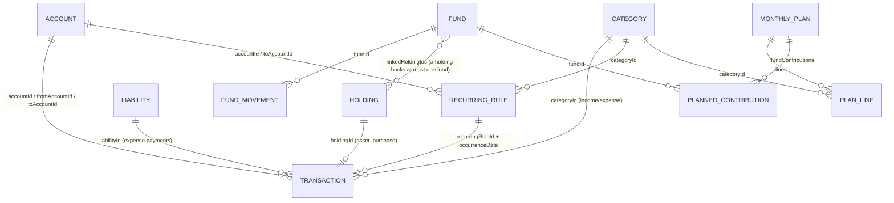

# Wealth — Technical Documentation

> Written from the code as of persisted-state **version 7** (`store/migrations.ts → CURRENT_VERSION`).
> Examples use the fake data in `store/seed.example.ts`. **Never copy figures from
> `store/seed.local.ts` (the owner's real data) into docs, tests or issues.**

---

## 1. Overview

Wealth is a **single-user, local-first, offline** personal-finance app (Expo / React Native,
Arabic UI, right-aligned). All data lives on the device in AsyncStorage; there is no server,
no login and no network dependency for any feature. The only network use is optional:
EAS Update (over-the-air JS updates) and the OS share sheet when exporting a backup. Due
reminders are *local* notifications scheduled on the device (no push server).

Product idea: **"every pound has a job"** (zero-based budgeting). Money sits in *accounts*
(cash/bank/wallet, in EGP/SAR/USD, located in Egypt or Saudi Arabia); savings goals are
*funds* that earmark cash and/or linked gold; a *monthly plan* gives every unit of expected
income a job; *safe to spend* tells the user what's left on flexible budget lines.

Multi-currency: amounts are stored in their own currency; totals are shown in EGP (net worth)
or in the plan currency (default SAR). Every transaction snapshots its exchange rate
(`rateToEGP`) so history doesn't change when rates change.

Islamic-finance constraint: the model deliberately has **no interest/APR fields** anywhere.

---

## 2. Tech stack (resolved versions from `package.json` / `node_modules`)

| Area | Package | Version |
|---|---|---|
| Framework | `expo` | 57.0.26 (SDK 57) |
| Runtime | `react-native` | 0.86.3 (New Architecture, Hermes) |
| UI lib | `react` / `react-dom` | 19.2.3 (React Compiler enabled in `app.json`) |
| Web | `react-native-web` | 0.21.2 |
| Navigation | `expo-router` | 57.0.24 (file-based, typed routes; React Navigation is vendored inside expo-router) |
| State | `zustand` (+ `persist` middleware) | 5.0.15 |
| Storage | `@react-native-async-storage/async-storage` | 2.2.0 |
| Crypto (backups) | `@noble/ciphers` / `@noble/hashes` | 2.4.0 / 2.4.0 (pure JS, ESM) |
| Random / UUID | `expo-crypto` | 57.0.3 (`randomUUID`, `getRandomBytes`) |
| Files | `expo-file-system` / `expo-sharing` / `expo-document-picker` | 57.0.7 / 57.0.22 / 57.0.3 |
| App lock | `expo-local-authentication` | 57.0.3 |
| OTA updates | `expo-updates` | 57.0.24 |
| Local notifications | `expo-notifications` | 57.0.21 (due reminders; native module, needs a build) |
| Date picker | `@react-native-community/datetimepicker` | 9.1.0 (native only; web uses `<input type="date">`) |
| Animations | `react-native-reanimated` / `react-native-worklets` | 4.5.1 / 0.10.1 |
| Language | `typescript` | 6.0.3 (`strict`) |
| Tests | `tsx` + `node:test` | 4.23.15 / Node 22 |
| Lint | `eslint` + `eslint-config-expo` | 9.x / 57.0.2 |

Other Expo modules present: `expo-constants`, `expo-font`, `expo-haptics`, `expo-image`,
`expo-linking`, `expo-splash-screen`, `expo-status-bar`, `expo-symbols`, `expo-system-ui`,
`expo-web-browser`, `react-native-gesture-handler`, `react-native-safe-area-context`,
`react-native-screens`.

---

## 3. How to run

```bash
npm install
npx expo start            # scan the QR with Expo Go (SDK 57) on Android/iOS
npx expo start --web      # web build (single-page output; no server rendering)
npm run test:logic        # pure-logic test suite (node:test via tsx)
npm run lint              # expo lint
npx tsc --noEmit          # type check (must be 0 errors)
npx expo-doctor           # dependency/config health (must pass)
```

Notes:
- Typed routes live in `.expo/types/router.d.ts` and are regenerated by `expo start`
  (git-ignored). If you add a route and `tsc` complains about an unknown href, run the dev
  server once.
- Expo Go limitations: Face ID is not available in Expo Go on iOS (fingerprint / device PIN
  work); `expo-updates` values are `null` in Expo Go. Local notifications (due reminders) work in
  Expo Go; only remote push would need a development build.
- First launch seeds data from `store/seed.local.ts` if present (git-ignored), otherwise from
  `store/seed.example.ts`.

---

## 4. Folder structure

```
app/                        expo-router routes
  _layout.tsx               Root Stack: (tabs), fund/[id], settings, recurring, due, categories,
                            review; mounts <RecurringRunner/>, <SnapshotRunner/> and <AppLockGate/>
  (tabs)/_layout.tsx        Bottom tabs (order): index, transactions, plan, assets, goals
  (tabs)/index.tsx          الرئيسية — dashboard
  (tabs)/transactions.tsx   المعاملات — month list grouped by day
  (tabs)/plan.tsx           الخطة — monthly plan
  (tabs)/assets.tsx         الأصول — accounts & holdings
  (tabs)/goals.tsx          الصناديق — funds
  fund/[id].tsx             Fund detail (stack)
  settings.tsx              Settings (stack)
  recurring.tsx             المعاملات المتكررة — rules list (stack)
  due.tsx                   المستحقات — due inbox (stack)
  categories.tsx            البنود — category management (stack)
  review.tsx                مراجعة الشهر — monthly review, ?month=YYYY-MM (stack)

components/
  AppLockGate.tsx           Biometric/PIN lock overlay (Modal)
  RecurringRunner.tsx       Invisible: processDue after hydration / on foreground; syncs reminders
  SnapshotRunner.tsx        Invisible: upserts this month's net worth snapshot (hydration, foreground, debounced changes)
  assets/EditAccountSheet   Edit account name, location, "current balance"; delete
  assets/HoldingSheet       Holding details (value, cost, value difference, linked fund) + delete
  assets/assetsUi.ts        Pure: LOCATION_LABELS, ACCOUNT_TYPE_ICONS, holdingTitle, signedDifference, groupAccounts
  categories/CategorySheet  Add / edit / archive / restore / delete a category
  dashboard/                SafeToSpendCard, MonthlySnapshot, RecurringCard (جاي قريب),
                            NetWorthCard (+ change vs last month), NextActionsCard,
                            homeInsights.ts (pure Home logic)
  funds/                    fundsUi.ts (pure: fundsSummary, fundNextStep, movementKind), FundCard, FundSheet (create/edit), AssignSheet (وزّعها),
                            CoverSheet (غطّيها), MoveMoneySheet (إضافة/سحب),
                            PaySinkingSheet (اتدفعت), UnassignedPanel, labels.ts
  plan/PlanEditorSheet      Edit a month's plan (live summary, lines by bucket with kind/limit/remove)
  plan/PlanLineRow          One plan line on the Plan screen (states via planUi.lineState)
  plan/planUi.ts            Pure: lineState, lineSentence, unplannedStatus, contributionDone,
                            planInputOf / withLine / withoutLine (savePlan inputs)
  plan/AddLineSheet         "أضف بند": من الموجود (search, by bucket) / بند جديد
  plan/LineSheet            One line: limit, ثابت/مرن, "نقل لـ" bucket, شيل من الخطة
  plan/labels.ts            BUCKET_TITLES, KIND_OPTIONS
  recurring/                recurringUi.ts (pure: ruleState, ruleDetailsOpen), RuleSheet (add/edit/delete rule), ConfirmOccurrenceSheet (تم),
                            labels.ts (Arabic frequency / mode / section labels)
  settings/                 ExportSheet, RestoreSheet, settingsUi.ts (pure: backupAgeLabel, BACKUP_NUDGE)
  transactions/             TransactionRow (shared row), TransactionSheet (add/edit) and its
                            presentational parts CategoryPicker, AccountPicker, GoldFields,
                            MoreDetails; transactionUi.ts (pure: FILTERS, filterTransactions,
                            emptyFilterMessage, quickCategories, transferTitle)
  ui/                       Design-system primitives: AppText, Card, Button, Chip/ChipRow,
                            StatusChip, Segment, ProgressBar, Money, AmountInput, FormField,
                            ListRow/ListGroup, SectionHeader, InsightCard, EmptyState;
                            Screen (outer layout + safe area), Fab,
                            DateFields (Past/Future), DatePicker(.web), FormSheet/FieldLabel/
                            FormInput, LoadingView, MonthSwitcher, ProgressBar, Segment,
                            icon-symbol(.ios), CurrencyText

store/                      ALL business logic lives here (pure, no React)
  types.ts                  Data model
  selectors.ts              Derived figures (balances, net worth, funds, month summary…)
  planning.ts               Monthly plan math (suggestion, progress, safe to spend…)
  recurring.ts              Recurring schedule engine (occurrences, due, upcoming, reminders)
  operations.ts             Validated state transitions → patches; sync bookkeeping
  nextActions.ts            Next Best Action engine (rules, priority, snooze)
  snapshots.ts              Monthly net worth snapshots (backfill, upsert, change)
  review.ts                 Monthly review numbers
  errors.ts                 FinanceValidationError + typed codes
  migrations.ts             v0 → v7 migration chain
  backup.ts                 Backup file format, AES-GCM/PBKDF2, open/validate/preview
  defaultCategories.ts      20 default categories (stable ids), FIXED_CATEGORY_IDS
  useFinanceStore.ts        Zustand store + persist config (the only RN-aware store file)
  seed.example.ts           Committed fake seed
  seed.local.ts             Owner's real opening position (git-ignored, EAS-uploaded)

utils/
  currency.ts               rateToEGP / toEGP / fromEGP
  dates.ts                  date keys, month keys, shiftMonth, monthsUntil, addMonthsToDate, daysBetween
  formatters.ts             formatCurrency, formatDate, formatDayLabel, formatMonthLabel,
                            formatPercent, Arabic count phrases (dueCountPhrase, daysAgoPhrase…)
  parseAmount.ts            Arabic/Western digits, separators → number
  errorMessages.ts          Error code → Arabic text (single place)
  runAction.ts              try action → show Arabic error
  dialogs(.web).ts          confirmAction / showMessage (Alert vs window.confirm/alert)
  backupFiles(.web).ts      Save (share sheet / download) and pick backup files
  appLock(.web).ts          Lock availability + authenticate
  appInfo(.web).ts          App version / runtime / channel / update id
  notifications(.web).ts    Local due reminders (permission, channel, schedule/cancel); web no-ops
  id.ts                     newId() = expo-crypto randomUUID

constants/                  theme.ts (design tokens), currencies.ts (DEFAULT_RATES), market.ts
tests/logic.test.ts         184 tests over store/*, utils/* and the pure UI helpers
docs/                       This file, USER_GUIDE.md, CHANGELOG.md
app.json / eas.json         Expo + EAS config
.easignore                  EAS upload filter (keeps store/seed.local.ts)
```

---

## 5. Navigation

Root `Stack` (`app/_layout.tsx`): `(tabs)` (no header), `fund/[id]` (title "الصندوق", replaced by
the fund name; back "رجوع"),
`settings` (title "الإعدادات"), `recurring` ("المعاملات المتكررة"), `due` ("المستحقات"),
`categories` ("البنود"), `review` ("مراجعة الشهر", replaced by "مراجعة {month}").
`<RecurringRunner/>` and `<SnapshotRunner/>` (render nothing) and `<AppLockGate/>` sit above everything.
`<StatusBar style="dark" />` (light theme only, dark icons on the light background).

### Layout & safe-area conventions

Edge-to-edge is always on (SDK 57 / RN 0.86): every screen and modal is drawn under the status
bar and the Android navigation bar, so insets must be handled explicitly. Rules:

- **`components/ui/Screen.tsx` is the only way a route sets its outer layout.** Props: `scroll`,
  `edges` (`'top' | 'bottom'`, default `['top']`), `contentStyle`, `refreshControl`, `header`
  (fixed above the content), `overlay` (absolute layer, e.g. a Fab). It uses
  `useSafeAreaInsets()` from `react-native-safe-area-context` (never React Native's
  `SafeAreaView`): `'top'` → `paddingTop = insets.top + 8` on the outer view (so scrolled content
  never slides under the status bar); `'bottom'` → `paddingBottom = insets.bottom + 16` on the
  scroll content (or the inner view when not scrolling), added on top of the screen's own
  `contentStyle` padding (so a list's `FAB_CLEARANCE` survives). Background = `colors.background`.
  On web the content is capped at `size.readableMax` (640) and centred; native is full width.
- **Tab screens** (`headerShown: false`): `edges={['top']}`; their own header row (e.g. the gear
  on الرئيسية) is part of the content, so it sits below `insets.top`. No `'bottom'` edge — the tab
  bar sits below the screen and already reserves `insets.bottom`.
- **Stack screens** always use the **native header** (Arabic title set in `app/_layout.tsx`, back
  "رجوع"; `fund/[id]` sets its title and "تعديل" button with `<Stack.Screen options>`). The header
  handles the top inset, so they use `edges={['bottom']}` — no top padding (no double inset), and
  the end of the content stays above the navigation bar / home indicator. No custom headers.
- **Floating "+" buttons:** `components/ui/Fab.tsx`, rendered in `<Screen overlay>`.
  `placement="tab"` → `bottom: 20` (the screen already ends at the tab bar, which includes
  `insets.bottom`); `placement="stack"` → `bottom: insets.bottom + 20`. Lists under a Fab end with
  `paddingBottom: FAB_CLEARANCE` (92) so the last row isn't covered.
- **Sheets:** every `*Sheet` is built on `FormSheet` (`Modal`, `presentationStyle="pageSheet"`,
  `statusBarTranslucent` + `navigationBarTranslucent`). `useSheetInsets()`: on Android the modal is
  a full-height window, so the header is padded by `insets.top`; on iOS the page sheet already
  starts below the status bar (top 0). The body always gets `paddingBottom: insets.bottom + 40`,
  so the last field or button scrolls clear of the navigation bar / home indicator.
- **AppLockGate:** full-screen, translucent `Modal`; content centred inside the safe area
  (padding = all four insets).
- Don't add hard-coded top paddings to compensate for the status bar (e.g. `paddingTop: 40`).
  On web all insets are 0.

| Route | Tab title | What it does |
|---|---|---|
| `/` (`index`) | الرئيسية | Calm Wealth Home (see "Home" below): greeting + date + settings icon; safe to spend (hero) → /plan; early-month "راجع الشهر اللي فات" card → /review; next best action card + "كمان X حاجات" list (store/nextActions.ts); هذا الشهر (income / spent / saved to funds / invested) → /transactions; جاي قريب → /recurring, /due; up to 3 funds → /fund/[id], "عرض كل الصناديق" → /goals; money available to plan (Assign/Cover sheets); net worth + change vs last month; last 5 transactions (tap to edit, "+ معاملة"). |
| `/transactions` | المعاملات | MonthSwitcher; MonthlySnapshot for the selected month (no link); filter chips الكل/مصروف/دخل/تحويل/ذهب (UI-only, by type); days (FlatList), each a header row (day label · day net in textSecondary, never red) and one ListGroup of TransactionRows (tap → edit); EmptyState for an empty month, a one-line message for a filter with no match; "+" FAB → TransactionSheet. |
| `/plan` | الخطة | Calm Wealth plan (see "Plan" below): MonthSwitcher; "خطة الشهر" + تعديل; MetricGroup الدخل المتوقع / المخطط / المتبقي للتخطيط + status line; safe-to-spend info row (ثابت/مرن explained); PlanLineRows by bucket (tap → LineSheet, saved via savePlan); "+ أضف بند" (AddLineSheet); fund contributions (tap → fund); spending outside the plan → /transactions; المعاملات المتكررة row. No plan: EmptyState + اقترح من مصروفي / انسخ خطة … / ابدأ من الصفر. Past months: "مراجعة {month}" row → /review?month= (chip "اتراجع" once done). |
| `/assets` | الأصول | Hero "إجمالي الأصول" (`totalAssetsEGP`) + MetricGroup سيولة / ذهب واستثمارات (gold cell) / التزامات (only when liabilities exist, text color); الحسابات ("+ حساب") grouped مصر / السعودية, archived ones in a collapsed "مؤرشفة" group (tap → EditAccountSheet); الذهب (total grams) as ListRows (value; cost · signed value difference in textSecondary; "مربوط بـ {fund}" gold chip; tap → HoldingSheet) or EmptyState → TransactionSheet on ذهب; other holdings / الالتزامات only when present; "+" FAB → add account / opening gold. Web QA: Metro serves `/assets` itself, open this tab from Home. |
| `/goals` | الصناديق | Calm Wealth funds (see "Funds, Recurring, Due" below): title; UnassignedPanel; MetricGroup إجمالي المحجوز / مطلوب الشهر ده / صناديق; sections الطوارئ · الأهداف · مصاريف دورية (empty ones skipped) of FundCards; EmptyState "لسه معندكش صناديق." + أنشئ صندوق طوارئ (FundSheet with emergency preselected); "+" FAB → FundSheet (goal). |
| `/fund/[id]` | (stack) | Hero (type + icon, current من target, bar with gold part, % + status chip, due + months left) · next step · actions (one primary: إضافة مبلغ, or اتدفعت for sinking) · facts ListGroup · linked gold (+ "ربط ذهب" → FundSheet when gold is linkable) · movements (newest first, last); header "تعديل" → FundSheet (edit / delete). `?allocate=1` (Home's fund actions) opens the allocate sheet. |
| `/settings` | (stack) | Groups: السوق (rates + "آخر تحديث", gold 24k/21k + 18k computed) · التخطيط (tracking start + the single primary "حفظ الإعدادات" for rates/gold/date; إدارة البنود, المعاملات المتكررة, تنبيهات المستحقات switch) · البيانات (backup status "آخر نسخة احتياطية" + age, overdue chip + Home's sentence, secondary "تصدير نسخة"; استعادة نسخة; استيراد البيانات الافتتاحية) · الأمان (قفل التطبيق switch) · عن التطبيق (version; collapsed "تفاصيل تقنية": runtime / channel / update id). `?export=1` opens the export sheet (Home's backup action). |
| `/recurring` | (stack) | "جاي خلال 30 يوم": ListGroup of up to 12 items + MetricGroup دخل / مصروف (per-currency totals from `upcoming`); groups دخل · مصروفات · تحويلات; rows: name + amount, frequency · account(s) · الجاية, chips تلقائي/بتأكيد · متوقف · انتهى (muted title when not active), pause/resume Switch beside (not inside) the tappable area; tap → RuleSheet; EmptyState; "+" FAB (stack). |
| `/due` | (stack) | Due inbox for `confirm` rules (oldest first): "فات ومتسجلش" (earlier months, amber "فات ميعاده" chip) and "المستحق الشهر ده"; rows in a ListGroup: name, amount (تقريباً), date · account, primary "تم" (ConfirmOccurrenceSheet) + tertiary "تخطّي"; EmptyState "مفيش حاجة مستنياك." + link to /recurring. |
| `/review` | (stack) | Monthly review, `?month=YYYY-MM` (default last month): الملخص · الخطة مقابل الفعلي · أكتر 5 بنود صرف + مصاريف مرة واحدة · الصناديق · خطوتك الجاية (suggest / copy next month's plan, وزّع الفايض); primary "خلّصت المراجعة" marks it reviewed. See "Monthly review" below. |
| `/categories` | (stack) | Dense ListGroups أساسيات · رفاهيات · عطاء · دخل · مؤرشفة (empty sections skipped): name, neutral "أساسي" chip on defaults, chevron; archived rows muted (with their old bucket); tap → CategorySheet (name; مصروف/دخل on create; bucket required for expenses with an inline error; أرشفة / استرجاع secondary; احذف البند destructive — only for unused custom ones); "+" FAB. |

### Design system (Calm Wealth)

The single source of truth for how the app looks. Every screen was migrated in phases 1–6; phase 7
removed the legacy aliases (`Colors`, `FinanceColors`, `Fonts`), the Expo template hooks
(`hooks/use-color-scheme*`) and all string-built alpha tints. `app/` and `components/` contain no
hex colors and no raw font sizes, weights, radii or shadows — only the tokens below.

**Tokens (`constants/theme.ts`)**
- **Colors** — `palette.light` → `colors` (type `ThemeColors`, keys = `ColorToken`); `colors` is
  the single switch point for a future dark palette. Grounds: `background` #F8F7F3, `surface`
  #FFFFFF, `surfaceSubtle`, `border`, `borderStrong`, `progressTrack`. Text: `text`,
  `textSecondary`, `textMuted` (placeholders/disabled only — fails 4.5:1). Brand green
  `primary900…primary50`, `onPrimary`. Gold: `gold`, `goldSurface`, `goldText`. States:
  `warning`/`warningSurface`, `danger`/`dangerSurface`. `scrim`. Need a new tint? Add one named
  token to the palette — never `color + '22'`.
- **`space`** xxs 2 · xs 4 · sm 8 · md 12 · lg 16 · xl 20 · xxl 24 · xxxl 32 · huge 40. In-between
  values are sums (`space.xs + space.xxs` = 6).
- **`radius`** sm 8 · md 12 · lg 16 · xl 24 · pill 999 (also for dots and discs).
- **`type`** (alias `typography`; keys = `TypeVariant`): moneyHero 34/44, moneyLg 24/32, moneyMd
  18/26, moneyRow 16/24, display 32/42, titleLg 26/36, title 22/30, section 18/26, body 16/26,
  bodyStrong 16/26 600, secondary 14/22, caption 13/20, micro 12/18, amountInput 48/58,
  amountInputCompact 40/50, sheetTitle 18/26. Money is rendered with `fontVariant: ['tabular-nums']`.
- **`weight`** regular 400 · medium 500 · semibold 600 · bold 700 (for a style that changes only
  the weight of a `type` entry, e.g. a selected chip).
- **`shadow.card`**, **`shadow.raised`** (the only two; the tab bar has none). `opacity` pressed
  0.85 / disabled 0.4. **`size`** touchMin 44, fab 56, icon 24, progress 8, readableMax 640.
- System fonts only; icons = MaterialIcons (+ `IconSymbol`).
- Hex values exist only in `constants/theme.ts` (palette, shadowColor) and `app.json` (splash /
  adaptive icon / notification colors, which native config needs as hex).

**Color semantics.**
- Green (`primary*`) = brand and the one primary action. Income is never green-coded, expense is
  never red-coded: `Money` picks its tone by meaning, never by sign.
- Gold = gold holdings only (value, gold part of a fund bar, "مربوط بـ" chip, gold metric cell).
- Amber (`warning`) = needs attention but nothing is wrong yet (fund "محتاج انتباه", plan line
  near its limit, overdue backup, missed due item, over-budget hint while typing).
- Red (`danger`) only where money is actually short or input is invalid. The complete list:
  negative unassigned (UnassignedPanel, Home cover InsightCard, CoverSheet deficit), an
  AssignSheet / FundSheet allocation that would make unassigned negative, a plan line over its
  limit (PlanLineRow / LineSheet "عدى الخطة", ProgressBar `over`), validation errors (FormField,
  AccountPicker, CategoryPicker, TransactionSheet), and the `destructive` Button (delete/cover).
- State is never conveyed by color alone: every colored state has a label (StatusChip, text) or
  an icon.

**RTL approach (one rule everywhere).** The app never enables `I18nManager` RTL (Expo's
`supportsRTL` is off), so the layout engine is always LTR and Arabic is laid out explicitly:
rows that read right-to-left use `flexDirection: 'row-reverse'` (first child = rightmost =
reading start), text uses `textAlign: 'right'` + `writingDirection: 'rtl'` (AppText default),
progress fills from the right, and "forward" chevrons point left (`chevron-left`). Money is
wrapped in a left-to-right isolate (U+2066…U+2069) so "ر.س 1,250" and its sign never get
reordered inside Arabic text. Inputs of numbers stay LTR (AmountInput).

**Primitives (`components/ui/`)** — each reads only tokens.

| Component | Props | Notes |
|---|---|---|
| `AppText` | `variant` (TypeVariant, default body), `color` (ColorToken, default text), `align` (default right), + Text props | Base of all primitives |
| `Card` | `variant` default \| subtle \| hero, `style` | default: surface, 1px border, radius.lg, padding lg, shadow.card · subtle: surfaceSubtle, flat · hero: radius.xl, padding xl |
| `Button` | `label`, `onPress`, `variant` primary \| secondary \| tertiary \| destructive, `icon?`, `disabled`, `loading`, `block`, `accessibilityLabel?` | minHeight 48, radius.md; primary pressed → primary900. One primary per screen or sheet (exception: each Due row's "تم") |
| `Chip` / `ChipRow` | `label`, `selected`, `disabled`, `onPress` | pill, minHeight 36 + hitSlop → 44; selected primary50 / primary700 border / primary800 semibold |
| `StatusChip` | `label` (required), `tone` ok \| attention \| danger \| gold \| neutral, `icon?` | Status never by color alone |
| `Segment` | `options`, `value` (may be undefined), `onChange` | Track surfaceSubtle, active surface + shadow.card + primary800 bold |
| `ProgressBar` | `progress` 0–1, `tone` normal \| attention \| over, `goldPortion?`, `height` | Fills primary600 / warning / danger from the right; gold part first; `accessibilityRole="progressbar"` |
| `Money` (+ `formatMoney` in pure `formatMoney.ts`) | `amount`, `currency`, `size` hero \| lg \| md \| row, `tone` default \| positive \| danger \| muted, `showSign?`, `converted?` {amount, currency}, `align` | Never colored by sign; tabular nums; `LRI` + symbol + `LRM` + sign + number + `PDI`. Never clipped: native shrinks to fit (`adjustsFontSizeToFit`, min 0.6); web wraps (`word-break: break-all`). Use `formatMoney` for money inside a sentence |
| `AmountInput` | `value`, `onChangeText`, `onChangeAmount?` (parseAmount), `currency`, `hint?` {tone neutral \| attention, text}, `allowZero`, `autoFocus`, `accessibilityLabel?` | type.amountInput (amountInputCompact when long), centred |
| `FormField` | `label`, `helper?`, `error?`, children (input) | Error: danger border + dangerSurface + icon + text. `FormInput`/`FieldLabel` in FormSheet share the look: borderStrong, radius.md, minHeight 48, body, placeholder textMuted |
| `ListRow` / `ListGroup` | `title`, `subtitle?`, `subtitleLines` (2), `icon?`, `iconTone` neutral \| ok \| gold, `trailing?`, `accessory?` (chips under the subtitle), `titleColor?`, `chevron?`, `archived?`, `onPress?`, `accessibilityLabel?` | 36px icon tile, minHeight 56; group = surface, radius.lg, border, hairline separators |
| `SectionHeader` | `title`, `actionLabel?`, `onAction?`, `trailing?` (non-pressable info) | section type + tertiary action |
| `MetricGroup` | `metrics: {label, value, tone?: 'gold'}[]`, `accessibilityLabel?` | One grouped surface, equal cells, hairline dividers. When a cell would be narrower than 96px it stacks into label/value rows |
| `InsightCard` | `tone` ok \| attention \| danger, `message`, `icon?`, `actionLabel?`, `onAction?` | Grounds primary50 / warningSurface / dangerSurface |
| `EmptyState` | `icon`, `title`, `body?`, `actionLabel?`, `onAction?`, `actionVariant` primary \| secondary | Icon disc + Button; `secondary` when the screen already has its primary |
| `Fab` | `onPress`, `accessibilityLabel` (required, Arabic), `placement` tab \| stack; `FAB_CLEARANCE` (92) | primary700, pill, shadow.raised |
| `FormSheet` | `visible`, `title`, `onCancel`, `onSave`, `saveLabel` ("حفظ"), `saveDisabled`; `useSheetInsets()` | background ground, hairline header, type.sheetTitle, cancel textSecondary, save primary700; header and body capped at 640 on web |
| `Screen` | `scroll`, `edges`, `contentStyle`, `refreshControl`, `header`, `overlay` | See "Layout & safe-area conventions"; bottom inset is added to the content's own bottom padding |
| `MonthSwitcher`, `DateFields`, `LoadingView`, `CurrencyText` | — | Tokens only; MonthSwitcher has no outer margin (screens space it) |

Pure date helper: `components/ui/formatDateAr.ts` → `formatDateAr(dateKey|iso, {year})` ("٥ أكتوبر ٢٠٢٦");
used instead of `utils/formatters.formatDate` (which prints English month names).

**Copy rules.** Egyptian Arabic, short, calm. No emoji, no English in the UI (technical details in
Settings excepted), no shaming ("محتاج انتباه", not "متأخر"/"فشلت"). Numbers are typed with
Arabic or Western digits (`utils/parseAmount`). Empty states say what's missing and offer the next
step. Icon-only buttons always carry an Arabic `accessibilityLabel`; every touch target is ≥ 44
(`size.touchMin`, hitSlop allowed).

**Adding a new screen — checklist.**
1. Route in `app/`; title in `app/_layout.tsx` for stack screens (native header, back "رجوع").
2. Wrap in `<Screen>`: tab → `edges={['top']}`; stack → `edges={['bottom']}`. No manual status-bar
   padding.
3. Build from the primitives above; only tokens for color, space, radius, type, shadow.
4. One primary Button. Destructive actions → `destructive` + confirm, placed last.
5. Money only through `Money` / `formatMoney`; never color by sign.
6. Add-button → `Fab` with an Arabic label, and `paddingBottom: FAB_CLEARANCE` on the list.
7. Forms → a `*Sheet` on `FormSheet`; amounts through `AmountInput`/`parseAmount`; errors in
   `FormField error`.
8. Empty state (`EmptyState`) and, if data loads, `LoadingView`.
9. Labels on icon-only controls; state shown by text/icon as well as color.
10. Check at 320 px and on a phone; update TECHNICAL / USER_GUIDE / CHANGELOG.

**Device QA checklist (owner, on the phone).** Web QA covers layout at 320/360/414 px, desktop
and 150% zoom; these need a real device (Android first):
- Edge-to-edge: no screen or sheet content under the status bar or the navigation bar (gesture
  and 3-button navigation); FABs sit above the navigation bar on الأصول / المعاملات / الصناديق /
  المتكررة / البنود.
- Keyboard: open each sheet (معاملة, بند, خطة، صندوق, توزيع, تغطية, حساب, ذهب, متكرر, تأكيد, نسخة,
  استعادة), focus the last field — it must stay visible above the keyboard and "حفظ" reachable.
- Back gesture / back button inside a sheet closes the sheet only (no navigation, no lost save).
- Long sheets (معاملة with «تفاصيل أكتر», تعديل الخطة, متكرر) scroll to the last button.
- Large font (Settings → Display → Font size max): Home hero, MetricGroups and fund cards don't
  clip; large amounts shrink instead of "…".
- Arabic digits typed from the keyboard (e.g. ١٢٬٥٠٠) in amount fields and in "+ حساب".
- App lock: enable, background the app, return → lock; fingerprint/PIN unlocks; cancel keeps it
  locked.
- Due reminders: a confirm rule due today → notification arrives; tapping opens the app.
- Export a backup and restore it (file picker / share sheet).
- Pull to refresh where offered; switching tabs keeps scroll position sensible.

### Navigation theme & tab bar (Calm Wealth phase 2)

- `app/_layout.tsx` passes a light React Navigation theme built from tokens (`background` and
  `card` = colors.background, `text`, `border`, `primary` = primary700); the color-scheme hook is
  no longer used (light only). Header titles and back behavior unchanged.
- `app/(tabs)/_layout.tsx`: same 5 tabs, order and `HapticTab`; bar on colors.background, hairline
  top border, no elevation/shadow; active primary700, inactive textSecondary; labels
  `type.micro` size/weight (no fixed lineHeight — it clipped Arabic glyphs); icons 24
  (`size.icon`). Web only: bar height 58 + bottom padding 6 (web has no bottom inset and the
  default 48px clipped the labels' descent).
- Icons (`components/ui/icon-symbol.tsx` mapping, SF Symbol → Material): house.fill → home,
  list.bullet.rectangle → receipt-long, calendar → event-note, wallet.pass →
  account-balance-wallet, target → track-changes.

### Home (Calm Wealth phase 2 · Next Best Action in data v7)

One question: *what should I know / do now?* Daily decisions first, long-term figures after.
Content padding `space.lg`, section gap `space.xxl`. Order (`app/(tabs)/index.tsx`):

1. **Header** — "صباح الخير" (before 12:00) / "مساء الخير", ar-EG date without year,
   settings icon button (textSecondary, 44pt, label "الإعدادات").
2. **SafeToSpendCard** (hero) — `safeToSpend` in the plan currency (Money hero, text color),
   "حتى نهاية الشهر · حوالي {safeToSpendToday} يومياً", StatusChip ok "خطتك ماشية كويس" or
   attention "في بند محتاج انتباه" + "صرف {lines} عدى الخطة" (`overspentLines`). No plan →
   explanation + primary "اعمل خطة الشهر" → /plan (never a 0). Tap → /plan.
3. **Review prompt** — days 1–7 of a month (`REVIEW_PROMPT_DAYS`) while `pendingReviewMonth` is
   set: InsightCard ok "راجع الشهر اللي فات" + "ابدأ المراجعة" → /review?month=. The matching
   `review-YYYY-MM` action is then left out of the list below.
4. **NextActionsCard** — `nextActions(state, now)` (store/nextActions.ts, table below), minus the
   review action when (3) shows and minus `plan-*` when there is no plan (the hero already asks).
   The first action is an InsightCard (tone/icon from `SEVERITY_LOOK`: urgent → danger, warning
   → attention, opportunity → ok + lightbulb, info → ok + info icon) with title, subtitle, the
   CTA and — when `dismissible` — "بعدين" (`dismissAction`, 24 h). The rest sit behind a toggle
   "كمان {حاجة واحدة / حاجتين / N حاجات / N حاجة}" as ListRows (tap = run the CTA). CTA routes:
   `/due`, `/plan`, `/review` (+month), `/settings` (+export=1), `/fund/[id]` (+allocate=1 opens
   the allocate sheet), or sheets Home owns: `cover` (CoverSheet), `assign` (AssignSheet),
   `new-emergency` (FundSheet initialType emergency).
5. **MonthlySnapshot** — "هذا الشهر" from `monthFlows` (EGP): دخل / مصروف, then اتحوّش للصناديق
   (net fund movements of the month at current rates) / استثمار (asset purchases at snapshot
   rates, gold cell), two MetricGroups of two cells. Tap or "كل المعاملات" → /transactions. (The
   Transactions screen keeps the 3-cell دخل / مصروف / صافي variant.)
6. **جاي قريب** (`RecurringCard`) — up to 3 `upcomingItems` as ListRows (name, day label or "بعد
   N أيام", amount; income rows green tile). Header action "الكل" → /recurring; a calm warning
   link "عندك N … · راجعهم" → /due when confirm items are due and no `due` action is listed.
   Hidden without content.
7. **الصناديق** — up to 3 `homeFunds` as FundCards; "عرض كل الصناديق" → /goals; subtle hint when
   there are none.
8. **UnassignedPanel** — positive: "فلوس متاحة للتخطيط" + "وزّع أموالك" (AssignSheet); negative:
   dangerSurface card "استخدمت جزء من فلوس الصناديق." + "غطّي الفرق" (CoverSheet); zero: nothing.
   Hidden when the top action is `cover`/`assign`.
9. **NetWorthCard** — "صافي الثروة" (Money lg); under it the change since last month's snapshot
   (`netWorthChange`: Money with sign, green ≥ 0 / danger < 0, "{±x.x%} عن {month}"; no % when it
   started at 0; hidden without a snapshot); مصر / السعودية lines (`netWorthByLocation`), سيولة /
   ذهب واستثمارات (gold dot) on a subtle strip.
10. **آخر المعاملات** — 5 `recentTransactions` in a ListGroup of TransactionRows ("+ معاملة" opens
    TransactionSheet; tap a row to edit); EmptyState "لسه مسجلتش معاملات." + "سجّل معاملة".

The separate BackupReminder card is gone: the backup nudge is rule 11 of the engine.

**Next Best Action engine** (`store/nextActions.ts`, pure, unit-tested). `allActions(state, now)`
returns every applicable action sorted by `priority` (= rule number; stable within a rule, funds in
priority order); `nextActions` drops snoozed ones. Each action:
`{ id, priority, severity, title, subtitle?, amount?, currency?, cta: { label, route, params? }, dismissible }`.

| # | id | Condition | Severity | Title | CTA |
|---|---|---|---|---|---|
| 1 | `due` | `dueOccurrences(today, 'confirm')` not empty | urgent | عندك {dueCountPhrase} | راجعهم → /due |
| 2 | `cover` | `unassignedEGP < −0.005` | urgent | صرفت {X} من فلوس مخصصة | غطّي الفرق → CoverSheet |
| 3 | `overspent` | this month's plan has `overspentLines` | warning | عدّيت ميزانية: {names} | افتح الخطة → /plan |
| 4 | `review-YYYY-MM` | `pendingReviewMonth`: last month had transactions (≥ trackingStartDate) and no `monthlyReviews` entry | opportunity | راجع شهر {month} | ابدأ المراجعة → /review?month= |
| 5 | `plan-YYYY-MM` | no plan this month | warning | اعمل خطة الشهر | اعمل الخطة → /plan |
| 6 | `emergency` | no active emergency fund → create; or emergency cash (EGP) < 1 month of essentials (`suggestedEmergencyTarget(3)/3`, needs history) → allocate | opportunity | ابدأ صندوق الطوارئ | أنشئ الصندوق → FundSheet / خصص الآن → fund |
| 7 | `sinking-<id>` | sinking fund with `nextDueDate − today ≤ 14` days (overdue included) and `target − fundCurrent > 0` | warning | فاضل {X} على {fund} | خصص الآن → /fund/[id]?allocate=1 |
| 8 | `behind-<id>` | `fundStatus = behind`, `fundMonthShortfall > 0`, not already listed in 7 | warning | {صندوق name} متأخر {shortfall} الشهر ده | خصص الآن → /fund/[id]?allocate=1 |
| 9 | `assign` | `unassignedEGP > 0.005` | opportunity | عندك {X} بدون وظيفة، وزّعها | وزّع أموالك → AssignSheet |
| 10 | `prices` | gold price (when gold holdings exist) or rates (when any non-EGP account / holding / fund / plan exists) updated ≥ 7 days ago | info | حدّث {سعر الذهب / أسعار الصرف / أسعار الذهب والصرف} | حدّث الأسعار → /settings |
| 11 | `backup` | there is data (transactions, funds or holdings) and `needsBackupReminder` (never, or ≥ 7 days) | info | اعمل نسخة احتياطية | تصدير نسخة → /settings?export=1 |

Snooze: `dismissAction(actionId)` stores `{ id = actionId, actionId, until = now + 24 h }`
(`SNOOZE_MS`), replacing an earlier snooze of the same action and dropping expired ones (with
tombstones). `NON_DISMISSIBLE_ACTION_IDS = ['due', 'cover']`: the operation refuses them
(`ACTION_NOT_DISMISSIBLE`) and `isSnoozed` ignores any record for them. Ids that embed a month or
fund make a snooze apply to that situation only. `fundMonthShortfall` (selectors) = this month's
required amount at month start − allocated this month, floored at 0 — the gap `fundStatus`
measures. `daysSince` / `daysSinceBackup` / `needsBackupReminder` moved here from the removed
`components/dashboard/BackupReminder.tsx` (Settings imports them from here).

**`components/dashboard/homeInsights.ts`** (pure; unit-tested): `homeFunds(state, now, max = 3)`:
behind first, then pending, then nearest due date (funds with a due date before those without),
then `fundsByPriority` order. `upcomingItems(state, now, max = 3)`: the first items of
`upcoming(30 days)`. `SEVERITY_LOOK`. `dueCountPhrase`, `withinDaysPhrase` (now in
`utils/formatters.ts`) and `daysBetween` (now in `utils/dates.ts`) are re-exported. The old
single-action `nextBestAction` was replaced by the engine.

**InsightCard** gained optional `title` (bodyStrong above the message, which then turns
textSecondary) and `dismissLabel` / `onDismiss` (a quiet textSecondary action after the main one).
No new tokens or styles.

**FundCard** (Home and the Funds tab): name (bodyStrong) + StatusChip · "{current} من {target}" ·
ProgressBar (attention when behind; `goldPortion = fundLinkedValue / target`) · one sentence +
percent · "الموعد: …". Status mapping (`components/funds/labels.ts` → `FUND_STATUS`,
`fundStatusSentence`; `STATUS_BADGES` derived for the fund detail screen):

| Status | Chip | Sentence |
|---|---|---|
| ahead | ok "متقدم" | — |
| on_track | ok "على المسار" | ماشي على الخطة |
| pending | neutral "الشهر ده" | محتاج {fundRequiredMonthly} الشهر ده (hidden if ≤ 0) |
| behind | attention "محتاج انتباه" (never red) | محتاج {fundRequiredMonthly} هذا الشهر للحاق بالخطة (hidden if ≤ 0) |
| no_deadline | neutral "بدون موعد" | لسه محتاج {target − current} للوصول للهدف / وصلت للهدف |

### Monthly review (`app/review.tsx`, data v7)

Stack screen "مراجعة {month}" (`?month=YYYY-MM`; invalid, missing or future → last month).
Numbers from `monthReview(state, month, now)` (`store/review.ts`, pure, unit-tested):

1. **الملخص** — MetricGroups دخل / مصروف / صافي (`monthSummary`, EGP) and نسبة التحويش
   (`savingsRate`, "—" without income) / تغير صافي الثروة (`monthNetWorthChange`: the month's
   snapshot — live figures for the current month — minus the previous month's; "—" when either
   is missing). Chip "اتراجع" when already reviewed.
2. **الخطة مقابل الفعلي** — per bucket "{spent} من {planned}" with chip "زيادة X" / "فاضل X"
   (`planProgress` buckets: planned lines only), up to 3 most overspent lines ("عدّت الخطة") and 3
   with most left ("وفّرت فيها"), "مصروف خارج الخطة". Without a plan: a subtle note.
3. **أكتر 5 بنود صرف** — regular expenses per category (one-time excluded; asset purchases are
   never expenses), share of the month's expenses; then **مصاريف مرة واحدة** one by one with
   their total.
4. **الصناديق** — every fund with a planned contribution or a movement that month: net allocated
   vs planned (plan currency, EGP without a plan), chip "اتخصص" / "أقل من الخطة"; then active
   funds that reached their target ("وصل للهدف").
5. **خطوتك الجاية** — next month has a plan → chip + "افتح الخطة"; otherwise "اقترح خطة الشهر
   الجاي" (`savePlan(planSuggestion)`) and "انسخ خطة {latest planned month before it}"
   (`copyPlan`). "وزّع الفايض ({unassigned})" → AssignSheet when unassigned > 0.

The primary "خلّصت المراجعة" calls `completeMonthlyReview(month)` (adds
`{ id: review-YYYY-MM, month, completedAt }`; once per month; `INVALID_MONTH` for a bad or future
month) and goes back. Entry points: action rule 4, Home's early-month card, and the Plan tab
("مراجعة {month}" row above the plan / empty state for past months, chip "اتراجع" once done).

### Net worth snapshots (`store/snapshots.ts`, `components/SnapshotRunner.tsx`, data v7)

- `syncedSnapshots(state, now)`: past months from `trackingStartDate`'s month (at most 36 back)
  without a snapshot get an `estimated` one (`netWorthAsOf(month end)`); the current month's is
  set to the live `netWorthFigures` (net worth, liquid, holdings, EGP). Returns null when nothing
  changes (figures within 0.005), so writing never loops. Op `recordNetWorthSnapshots`.
- `netWorthAsOf(state, date)` (selectors): accounts whose `openingDate` is after `date`,
  transactions dated after it, holdings bought (`purchaseDate`) and liabilities started after it
  are left out; missing dates count as always there. Valued at **current** rates and prices (no
  price history), so estimates of past months move with today's gold price and rates.
- `SnapshotRunner` (mounted in `app/_layout.tsx` next to RecurringRunner): records after
  hydration, when the app returns to the foreground, and 1.5 s after the last change to
  accounts, transactions, holdings, liabilities or settings.
- `netWorthChange(state, now)`: live net worth − last month's snapshot (`pct` = change ÷
  |start|, null from 0); null without the snapshot.

### Assets, Categories, Settings, Backup, Lock (Calm Wealth phase 6)

- Assets / Categories / Settings: see the route table. Balances first; value differences are
  secondary text with a sign, never green/red, no percent or arrows.
- EditAccountSheet now holds the account delete (moved from a trash icon on the row; same
  confirm, still refused with `ACCOUNT_IN_USE`). There is no account archive action.
- HoldingSheet is read-only details + "احذف الأصل" (same confirm; a gold purchase still has to be
  deleted from its transaction — `HOLDING_HAS_PURCHASE`).
- `TransactionSheet` takes an optional `initialType` (new transactions only) for the Assets gold
  empty state.
- Export / Restore sheets: presentation only — the password checks, messages, `createBackup` /
  `openBackup` / `restoreBackup` calls and file format are unchanged; their messages are also shown
  inline (FormField error). Export uses a Segment (بكلمة سر / بدون كلمة سر) and an attention card
  for unencrypted files; Restore shows "الاستعادة هتستبدل البيانات الحالية." above the preview
  rows and keeps the confirm dialog.
- Backup status in Settings uses `daysSinceBackup` / `needsBackupReminder` (same 7-day rule as
  Home) and `backupAgeLabel`; the nudge sentence is shared (`BACKUP_NUDGE`).
- Lock screen (`AppLockGate`, behavior unchanged): 72px primary50 disc with a lock icon, "Wealth"
  (display), "بياناتك المالية محمية", primary "فتح التطبيق" (retries `authenticate`). On web the
  lock is unavailable (switch disabled with the reason) and `authenticate` returns false.
- Fund percent is capped (`fundPercent` in fundsUi.ts): past the target FundCard and the fund hero
  show "100%" + "تخطيت الهدف"; the detail also shows "{real}% من الهدف".

### Funds, Recurring, Due (Calm Wealth phase 5)

**Funds tab** — "what am I preparing for?". `fundsSummary` (pure): إجمالي المحجوز = Σ `fundCurrent`
in EGP, مطلوب الشهر ده = Σ `fundRequiredMonthly` (funds with a due date) in EGP, both converted at
current rates with `toEGP`; صناديق = count of active funds. Archived funds aren't shown (as before;
there is no archive action in FundSheet).

**Fund detail** order — hero → next step → actions → facts → linked gold → history:
- Next step (`fundNextStep`): behind → attention InsightCard "خصص {required} هذا الشهر للبقاء على
  المسار."; pending → neutral "محتاج {required} الشهر ده."; on track / ahead → ok "ماشي على
  الخطة."; no deadline → "لسه محتاج {remaining} للوصول للهدف."; reached → ok "وصلت للهدف.".
- Actions: إضافة مبلغ (primary) + سحب مبلغ (secondary); sinking: اتدفعت (primary) + إضافة
  (secondary) + سحب (tertiary). Both money buttons open MoveMoneySheet on that side.
- Facts: مطلوب شهرياً, نقداً في الصندوق, قيمة الذهب المربوط, الموعد / الاستحقاق القادم, التكرار —
  only those that apply.
- History (`movementKind`): allocation "+X" green; withdrawal "−X" text color (not red); sinking
  payment (note "اتدفعت: …") labelled اتدفعت, muted.

**Fund sheets** (logic unchanged — the logic sections diff empty):
FundSheet — type Segment (الطوارئ / هدف / مصاريف دورية), name, target as AmountInput (the fund
keeps its currency; there is no currency choice today), emergency suggestions as tertiary
"استخدم المقترح (٣ / ٦ شهور): X", deadline (FutureDateField, "بدون موعد"), sinking frequency +
next due date (+ suggested monthly), priority, linked gold chips, edit: cash allocation + "فلوس
متاحة للتخطيط بعد الحفظ" preview, احذف الصندوق. MoveMoneySheet — إضافة / سحب Segment (starts on
the side that opened it), AmountInput with "المتاح للتخطيط" / "في الصندوق نقداً" hint, note (there
is no date field). PaySinkingSheet — AmountInput, AccountPicker, CategoryPicker, date, note, one
line about the withdrawal and the next due date. AssignSheet — live "هتوزّع X من Y" + what stays
available, "وزّع المقترح" (fills `suggestAllocation`, as before), fund ListRows with an amount input
on the end side. CoverSheet — deficit card, "غطّي الفرق من الصناديق دي:", selectable fund rows with
the `planCover` withdrawal, result line (amber when something is still uncovered).

**Recurring** — see the route table. `ruleState`: paused (inactive) · ended (no `nextDate`) · active.

**RuleSheet** disclosure order: kind (دخل · مصروف · تحويل) · AmountInput + "المبلغ بيتغير"
switch · name · CategoryPicker + AccountPicker (or من / إلى, plus "المبلغ المستلم" when the
currencies differ — required, so it stays in the main flow) · frequency Segment (أسبوعي · شهري ·
سنوي) + interval / day of month side by side · start date · mode Segment (تلقائي "بيتسجل لوحده في
ميعاده." / بتأكيد "بيستناك تأكده من المستحقات.") · "تفاصيل أكتر" (end date, note; open when editing
a rule that has one — `ruleDetailsOpen`) · احذف المتكرر. Logic unchanged.

**Due** — see the route table. ConfirmOccurrenceSheet: AmountInput (hint for variable amounts),
received amount for cross-currency transfers, AccountPicker, date, note; save label "سجّل".

### Plan (Calm Wealth phase 4)

**Screen** (`app/(tabs)/plan.tsx`) — "where should this month's money go?":
1. MonthSwitcher; "خطة الشهر" + tertiary تعديل (PlanEditorSheet).
2. `MetricGroup`: الدخل المتوقع · المخطط (line limits + contributions) · المتبقي للتخطيط (`unplanned`),
   all in the plan currency. Status (`unplannedStatus`, tolerance 0.5): balanced → ok chip "كل الدخل
   متخطط له" + "0 … غير مخطط"; under → "لسه X محتاجة تتخطط" + خطّطها; over → attention "مخطط أكتر من
   الدخل المتوقع بـ X" + راجع الخطة (both open the editor).
3. Info row "المرن هو اللي بيتحسب في «تقدر تصرف بأمان»: {safeToSpend} متاح." — expands (component
   state) to "ثابت: مبلغ محجوز لمصروف معروف." / "مرن: جزء من المبلغ المتاح للصرف.". Same
   `safeToSpend` as Home.
4. Buckets أساسيات · رفاهيات · عطاء (skipped when empty): SectionHeader with "{spent} من {planned}" as
   `trailing`, then one ListGroup of `PlanLineRow`; "+ أضف بند" (AddLineSheet) after them.
5. تحويش للصناديق: rows "{allocated} من {planned}" + thin ProgressBar; "اتخصص" chip when
   `contributionDone`; tap → /fund/[id]; never red.
6. "مصروف خارج الخطة: X" (`unplannedSpent`) + المعاملات → /transactions; neutral.
7. المعاملات المتكررة ListRow → /recurring.
No plan: EmptyState "مفيش خطة لشهر …" with primary اقترح من مصروفي, secondary انسخ خطة {previous}
(only when `previousPlanMonth` exists), tertiary ابدأ من الصفر — same create calls and messages.

Screen-level line edits: tapping a line opens `LineSheet` (with `progress`); its save calls
`savePlan(withLine(plan, …))`, its remove `savePlan(withoutLine(plan, id))`. "+ أضف بند" saves an
existing category the same way; a "بند جديد" is already saved by `addCategoryWithPlanLine`, so the
screen doesn't add it twice. The editor keeps its own draft as before.

**PlanLineRow** (`lineState` in `components/plan/planUi.ts`):

| State | Condition | Shows |
|---|---|---|
| normal | otherwise | "{spent} من {limit}" · "متبقي X" · bar normal |
| approaching | flexible, limit > 0, pct ≥ 0.85, not over | amber "قرب الحد" chip · bar attention |
| over | spent > limit (+0.005) | red ⓘ "عدى الخطة بـ {spent − limit}" · bar over (the one red state) |
| paid | fixed, limit > 0, limit − 0.005 ≤ spent ≤ limit + 0.5 | ok "اتدفع" chip, no warning |

Line 1 name (muted when the category is archived) + ثابت/مرن chip; line 2 amounts; line 3 bar
(height 6); minHeight 64, the whole row is the hit area. `lineSentence` gives LineSheet's sentence
("صرف … عدى الخطة بـ X." / "اتدفع." / "قرب الحد: متبقي X." / "متبقي X.").

**Sheets** (logic unchanged; the editor's logic section diffs only by a comment):
PlanEditorSheet — live "المتبقي للتخطيط" at the top of the content (same tone rules), currency
Segment, expected income as AmountInput, lines by bucket (name → LineSheet, ثابت/مرن Segment,
right-aligned limit, remove icon with an accessibility label; no confirm, as before), "+ أضف بند",
fund contributions, احذف الخطة. AddLineSheet — search + CategoryPicker (grouped when expanded),
limit as AmountInput, ثابت/مرن with a one-line helper, إدارة البنود. LineSheet — kind chip, "{spent}
من {limit}" + bar + sentence (when the saved line has progress), limit, kind, نقل لـ, شيل من الخطة.
It doesn't list transactions (it didn't before). `FormInput` now right-aligns via style (web
ignored the prop).

### Transactions (Calm Wealth phase 3)

**Screen** (`app/(tabs)/transactions.tsx`) — "what happened?", built for scanning 10–20 rows:
MonthSwitcher · `MonthlySnapshot` (`month`, `linkToTransactions={false}`) · filter chips
(`transactionUi.FILTERS`; `filterTransactions` over `transactionsForMonth`) · days from
`groupTransactionsByDay`: header row (formatDayLabel on the right, `Money` muted with sign on the
left — the day net is never red) + one `ListGroup` per day. Empty month → `EmptyState` "مفيش
معاملات في الشهر ده." + "سجّل معاملة"; filter without matches → `emptyFilterMessage` ("مفيش
تحويلات في الشهر ده."). Bottom padding `FAB_CLEARANCE`; Fab placement 'tab'.

**TransactionRow** (Home and Transactions; props unchanged, `isLast` accepted but unused — the
ListGroup draws separators) on `ListRow`:

| Part | expense | income | transfer | gold purchase |
|---|---|---|---|---|
| Icon tile | north-east, neutral | south-west, ok | swap-horiz, neutral | diamond, gold |
| Title | category (textMuted if archived) | category | `transferTitle(from, to)` = "from ← to" with RLMs | holding name |
| Subtitle (1 line) | account · note · date* | same | "تحويل بين حساباتك" · note · date* | account · note · date* |
| Amount | text color, no sign | green "+" | text color (source currency) | text color |

\* date only with `showDate` (Home). Chips under the subtitle: لمرة واحدة (oneTime), متكرر
(`recurringRuleId`), مؤرشف (archived category). Non-EGP amounts show "≈ X ج.م" from the stored
`rateToEGP` snapshot (never current rates). minHeight 56; accessibilityLabel = title, amount, date.

**TransactionSheet** — progressive disclosure; the fastest path is amount → category → حفظ. All
state, defaults, type-switch rules and `handleSave` are unchanged from before (only an inline
copy of three validation messages was added); the parts are presentational:
1. `Segment` مصروف · دخل · تحويل · ذهب (adding only; editing a non-gold transaction hides ذهب;
   a saved gold purchase shows a gold "شراء ذهب" chip instead — its type is locked).
2. `AmountInput` (autoFocus when adding) in the account's currency (the from-account for
   transfers); budget hint under it for new expenses when `spendImpact` returns data: neutral
   ✓ "هيفضل {remainingAfter} في {category}" or attention ⓘ "المبلغ ده هيعدّي ميزانية {category}
   بـ {overBy}" (plan currency). Never blocks saving.
3. `CategoryPicker` (income/expense): `quickCategories` — last-used first, then picker order, max
   6, the selected one always shown — and "كل البنود" expanding the full list inline, grouped under
   أساسيات / رفاهيات / عطاء for expense categories (quick chips stay flat). Also used by
   AddLineSheet (with `forceExpanded` while searching and `label={null}`).
4. `AccountPicker`: one line "من / في / دفعت من {account} · {currency}" that expands account
   chips; transfers have من and إلى; a cross-currency transfer adds the "المبلغ المستلم" FormField
   pre-filled with the converted amount (as before).
5. Date (`PastDateField`; other dates now in Arabic via `formatDateAr`).
6. `GoldFields` (ذهب only): weight, karat Segment, location Segment, optional name (auto-name as
   placeholder); gold accent on the section label. Cost = the amount.
7. `MoreDetails` "تفاصيل أكتر" (collapsed when adding; open when editing a transaction with a
   note, oneTime or a recurring link): note (multiline), oneTime Switch (expenses), "خلّيها
   معاملة متكررة" (tertiary; opens RuleSheet with the existing prefill, only for saved, unlinked,
   non-gold transactions).
8. "احذف المعاملة" (destructive Button, edit only) with the existing confirm.
Inline errors (amount / account / category) appear under their field in addition to the existing
alerts; error codes are unchanged. `AmountInput` stretches with a flexing input (a web `<input>`
otherwise takes its intrinsic width and pushes the number off-screen) and centers via style.

---

## 6. Data model (`store/types.ts`)

Conventions: amounts are in the entity's own currency unless the field name ends in `EGP`;
dates are local `YYYY-MM-DD`; months are `YYYY-MM`; `createdAt`/`updatedAt` are ISO timestamps.
Every synced entity has `updatedAt` (set only by operations).

- `CurrencyCode = 'EGP' | 'SAR' | 'USD'`; `Location = 'EG' | 'SA'`
- `Bucket = 'essentials' | 'lifestyle' | 'giving' | 'income'`; `ExpenseBucket` excludes `income`
- **Account** `{ id, name, type: cash|bank|wallet, currency, openingBalance, openingDate?, location, createdAt, archived?, updatedAt }` — balance is **derived**, never stored.
- **Category** `{ id, name, kind: income|expense, bucket, isDefault, archived?, updatedAt }` — `archived` missing = false (optional field, no migration).
- **Transaction** (discriminated union on `type`, common: `id, amount, date, note?, rateToEGP, createdAt, updatedAt`):
  - common optional `recurringRuleId?` + `occurrenceDate?` (the rule occurrence this transaction records; any type)
  - `income | expense`: `currency` (= account currency), `accountId`, `categoryId`, `liabilityId?`, `oneTime?`
  - `transfer`: `fromAccountId`, `toAccountId`, `toAmount` (in the target account's currency)
  - `asset_purchase`: `accountId`, `currency`, `holdingId` — cash turned into a holding
- **Fund** `{ id, name, type: emergency|goal|sinking, targetAmount, currency, deadline? (goals), priority (lower = more important), monthlyContribution?, linkedHoldingIds[], createdAt, archived?, frequency?: yearly|semiannual|quarterly, nextDueDate? (sinking), updatedAt }`
- **FundMovement** `{ id, fundId, amount (+allocate / −withdraw, fund currency), date, note?, updatedAt }`
- **Holding** (union): `gold { weightGrams, karat: 18|21|24 }` or `currency { currency, quantity }`; common `id, name, purchaseCostEGP, purchaseDate?, location? (default EG), note?, updatedAt`
- **Liability** `{ id, name, principal, currency, monthlyPayment?, startDate, notes?, updatedAt }` (no interest)
- **RecurringRule** `{ id, name, kind: income|expense|transfer, amount, currency (= account currency), accountId, categoryId? (income/expense), toAccountId?, toAmount? (transfers; required when currencies differ), frequency: weekly|monthly|yearly, interval ≥ 1, dayOfMonth? 1–31 (clamped to month end), startDate, endDate?, nextDate ('' when nothing is left), mode: auto|confirm, variableAmount, active, skippedDates[], note?, createdAt, updatedAt }`
- **MonthlyPlan** `{ id = plan-YYYY-MM, month, currency, expectedIncome, lines: PlanLine[], fundContributions: PlannedContribution[], createdAt, updatedAt }`
  - `PlanLine { categoryId, limit, kind: fixed|flexible }`, `PlannedContribution { fundId, amount }` (plan currency)
- **Settings** `{ exchangeRates {SAR_EGP, USD_EGP, lastUpdated}, goldPrice24kEGP, goldPrice21kEGP, goldPriceUpdatedAt, trackingStartDate, deviceId, lastBackupAt?, appLockEnabled?, dueNotificationsEnabled?, lastUsed? }`
- **NetWorthSnapshot** (v7) `{ id = nw-YYYY-MM, month, netWorthEGP, liquidEGP, holdingsEGP, takenAt, estimated?, updatedAt }` — one per month; the current month follows the live figures, `estimated` marks months filled in afterwards.
- **ActionDismissal** (v7) `{ id = actionId, actionId, until (ISO), updatedAt }` — a snoozed Next Best Action.
- **MonthlyReview** (v7) `{ id = review-YYYY-MM, month, completedAt, updatedAt }` — a finished review.
- **Tombstone** `{ entity: SyncEntity, id, deletedAt }` — deletion log for a future sync. `SyncEntity` also covers `netWorthSnapshot`, `actionDismissal`, `monthlyReview` (v7).
- **FinanceState** `{ accounts, categories, transactions, funds, fundMovements, holdings, liabilities, recurringRules, monthlyPlans, netWorthSnapshots, actionDismissals, monthlyReviews, settings, tombstones }`



---

## 7. State & persistence (`store/useFinanceStore.ts`)

- One Zustand store `useFinanceStore` = `FinanceState` + actions + `hasHydrated`.
  Every action calls a pure function from `operations.ts` with `get()` and the context
  `{ newId: expo-crypto randomUUID, now: () => new Date() }`, then `set(patch)`. Actions throw
  `FinanceValidationError`; UI wraps them with `runAction` (Arabic alert).
- `persist` middleware: key **`@wealth_finance_state`**, `version: CURRENT_VERSION` (7),
  `partialize` = `dataOf()` (data only; no actions or `hasHydrated`).
- Storage: `legacyAwareStorage` wraps AsyncStorage; if the stored JSON has no `state` envelope
  (pre-Zustand data) it is presented as `{ state, version: 0 }` so it migrates instead of being
  discarded.
- **SSR guard:** `isServer = Platform.OS === 'web' && typeof window === 'undefined'` → a no-op
  storage and `skipHydration: true`, so nothing touches AsyncStorage during web server rendering.
  (`web.output` is `"single"` today, so there is no server rendering, but the guard stays.)
- **Hydration:** screens render `<LoadingView/>` until `hasHydrated`. `onRehydrateStorage`
  sets `hasHydrated` and calls `ensureDeviceId` (creates `settings.deviceId` on first launch).
- **Seed:** `loadSeed()` → `require('./seed.local')` in try/catch, falling back to
  `seed.example` (Expo's Metro enables optional dependencies). Seeds are written in the v3
  shape and passed through `migratePersistedState(seed, 3, …)`.
- **AsyncStorage keys**

| Key | Written when |
|---|---|
| `@wealth_finance_state` | Every state change (persist) |
| `@wealth_finance_state_backup_v{N}` | Before migrating persisted data from version N (raw payload) |
| `@wealth_finance_state_backup_before_import` | Before "استيراد البيانات الافتتاحية" |
| `@wealth_finance_state_backup_before_restore` | Before restoring a backup file |

---

## 8. Migrations (`store/migrations.ts`)

`migratePersistedState(persisted, version, { now, newId })` runs every step whose version is
greater than the stored one. Used by `persist.migrate` **and** by backup restore.

| Step | Changes |
|---|---|
| v0 → v1 | Envelope only (pre-Zustand bare JSON). `normalizeV1` fills missing collections. |
| v1 → v2 | cash/bank assets → Accounts (`openingBalance = amount`, `location: 'EG'`); gold assets → GoldHoldings (`purchaseCostEGP = toEGP(purchasePrice)`); goals → Funds (`type: 'goal'`, priority = index+1). **All gold links to the first goal only.** Opening FundMovement per goal = `max(0, min(currentAmount − linked gold value, liquid still available))`; total clamped amount is returned as `clampedBy` (dev log). v1 transactions attach to the first account in their currency (or a new `acct-legacy-{cur}`), categories "دخل آخر"/"أكل وبقالة", old category text kept in `note`, `rateToEGP` from v1 rates. |
| v2 → v3 | `account.location ??= 'EG'`; `goldPrice21kEGP ??= 24k × 21/24`; `trackingStartDate ??= '2026-08-05'`; adds missing default categories **by id** (renamed defaults are kept). |
| v3 → v4 | `updatedAt ??= createdAt ?? now` on every entity; `tombstones ??= []`; `settings.deviceId ||= newId()`. |
| v4 → v5 | Legacy plans `{ month, expectedIncomeEGP, bucketLimitsEGP }` → `{ id: plan-YYYY-MM, currency: 'EGP', expectedIncome, lines: [], fundContributions: [] }` (bucket limits can't map to categories); monthly-plan tombstones keyed by month are re-keyed to `plan-YYYY-MM`. |
| v5 → v6 | Legacy rules `{ type, nextDate, … }` → `RecurringRule`: `kind = type`, `interval: 1`, `dayOfMonth` = day of `nextDate` (not for weekly), `startDate = nextDate`, `mode: 'confirm'` (nothing is recorded without the user), `variableAmount: false`, `skippedDates: []`, `createdAt = updatedAt ?? now`. Rules that already have `kind` pass through unchanged. |
| v6 → v7 | `netWorthSnapshots ??= []`, `actionDismissals ??= []`, `monthlyReviews ??= []`; then every past month from `trackingStartDate`'s month (at most 36) up to the month before `now` that has no snapshot gets an `estimated` one from `netWorthAsOf(month end)` at the current rates/prices, `takenAt = now`. The current month is left to the SnapshotRunner. Existing snapshots are never changed. |

Idempotence rules: v2→v3 … v6→v7 only fill missing values and keep existing ones, so
running them twice yields the same result (tested). Before migrating, the raw payload is
saved to `@wealth_finance_state_backup_v{N}`.

---

## 9. Operations layer (`store/operations.ts`)

Pure `(state, input, ctx) → Partial<FinanceState>`; throw `FinanceValidationError(code, details)`.
Multi-step operations build a draft and return one combined patch, so they are **atomic**
(nothing applies if any step throws).

**Sync bookkeeping:** creates/updates set `updatedAt = now` (`stamp`); every delete, including
cascades, appends a tombstone (`logDeletes`). Update inputs are `Editable<T>` (updatedAt optional).

Key validation rules:
- Names required; amounts `> 0`; non-negative fields `≥ 0`; dates `YYYY-MM-DD`; months `YYYY-MM`.
- Income/expense: account & category exist; `currency === account.currency`; category kind = type;
  liability payments must be expenses in the liability's currency.
- Transfer: both accounts exist and differ; `toAmount` defaults to the converted amount.
- `updateTransaction`: keeps `createdAt`; keeps `rateToEGP` unless the currency changes
  (then re-snapshots at the current rate) — for transfers the currency is the from-account's, so
  moving a transfer to a from-account in another currency re-snapshots too; a gold purchase can't change type (`ASSET_PURCHASE_TYPE_LOCKED`).
- Accounts: currency locked once used; delete refused when referenced (`ACCOUNT_IN_USE`).
- Categories: name trimmed, required and **unique among active categories** (case-insensitive,
  `CATEGORY_NAME_TAKEN`; archived names are free); income kind ⇔ income bucket; `updateCategory`
  can rename/move bucket but never changes `kind` (`CATEGORY_KIND_LOCKED`) or `isDefault`;
  `archiveCategory(id, archived)` hides/restores (restoring re-checks the name); `deleteCategory`
  only for custom categories (`DEFAULT_CATEGORY_DELETE`) that `categoryInUse` says are unused —
  no income/expense transaction, recurring rule or plan line (`CATEGORY_IN_USE`) — with a tombstone.
- Pickers (TransactionSheet, RuleSheet, PaySinkingSheet, AddLineSheet) use
  `selectors.pickerCategories(categories, kind, keepIds)`: active categories of the kind, plus the
  category the edited item already uses. Reports, history and plan progress use all categories.
- Funds: target `> 0`; sinking funds need `frequency` + `nextDueDate`; `normalizeFundShape`
  drops `deadline` from sinking funds and the schedule from others; **a holding backs at most
  one fund** (`HOLDING_ALREADY_LINKED`); delete cascades its movements and removes it from plans.
- Holdings: gold weight `> 0`, karat ∈ {18,21,24}; a holding created by a purchase can only be
  removed by deleting the purchase (`HOLDING_HAS_PURCHASE`).
- Recurring rules: name, amount `> 0`, interval integer ≥ 1, dayOfMonth 1–31, valid start/end
  (end ≥ start), mode auto|confirm; account exists and `currency === account.currency`; transfers
  need a different target account and `toAmount > 0` when currencies differ; income/expense need a
  category of the same kind. `nextDate` is always recomputed by operations.
- Plans: valid month/currency; lines use existing **expense** categories, no duplicates, limit ≥ 0;
  contributions reference existing funds, no duplicates.

Atomic operations: `buyGold`, `updateGoldPurchase`, `deleteTransaction` (purchase → holding too),
`editFund` (details + one adjustment movement), `allocateMany`, `withdrawMany`, `paySinkingFund`,
`copyPlan`, `addCategoryWithPlanLine` (new expense category + a line in the month's saved plan via
`savePlan`; `PLAN_NOT_FOUND` without a plan), `replaceWithSeed`, `restoreFromBackup`, `processDue`, `confirmOccurrence`,
`addRecurringRule` (with link), `deleteRecurringRule` (rule + unlinking).

Recurring operations:
- `addRecurringRule(input, linkTransactionId?)` — "خليها متكررة" passes the edited transaction;
  it is linked as the occurrence on its date (when that date is an occurrence and it isn't
  already linked), so it doesn't show up as due.
- `updateRecurringRule` keeps `createdAt`; `setRecurringActive(id, active)` — resuming adds the
  occurrences that fell due while paused (up to yesterday) to `skippedDates`.
- `deleteRecurringRule` removes the rule, strips `recurringRuleId`/`occurrenceDate` from its past
  transactions (they keep amount, date, account, rate) and adds a tombstone.
- `processDue()` records every due occurrence of **auto** rules (missed ones too) in one patch,
  rate = **current** rate, note = rule note or name, then advances `nextDate`. Idempotent (a handled
  occurrence isn't due); a rule that fails validation (e.g. deleted account) is left pending; returns
  `{}` when nothing is due (the store then doesn't write).
- `confirmOccurrence(ruleId, date, { amount?, date?, accountId?, toAmount?, note? })` (تم) and
  `skipOccurrence(ruleId, date)` (تخطّي) throw `OCCURRENCE_NOT_DUE` if the occurrence is not
  pending. `setDueNotifications(enabled)` stores the Settings toggle.
- `TransactionSheet` edits keep `recurringRuleId`/`occurrenceDate` on every type.

Error codes (`store/errors.ts`) → Arabic in `utils/errorMessages.ts` (`errorMessage()`), with
entity/field labels interpolated (e.g. `NOT_POSITIVE` + field `weightGrams` → "الوزن يجب أن يكون أكبر من صفر"):

`NAME_REQUIRED, NOT_FOUND, NOT_POSITIVE, NEGATIVE, NOT_A_NUMBER, INVALID_DATE, INVALID_MONTH,
INVALID_KARAT, INVALID_FREQUENCY, INVALID_MODE, CURRENCY_MISMATCH, CATEGORY_KIND_MISMATCH,
CATEGORY_BUCKET_MISMATCH, LIABILITY_PAYMENT_NOT_EXPENSE, SAME_ACCOUNT_TRANSFER, ACCOUNT_IN_USE,
ACCOUNT_CURRENCY_LOCKED, CATEGORY_IN_USE, LIABILITY_IN_USE, LIABILITY_CURRENCY_LOCKED,
WITHDRAW_EXCEEDS_FUND, HOLDING_ALREADY_LINKED, INSUFFICIENT_UNASSIGNED, NOTHING_SELECTED,
SINKING_SCHEDULE_REQUIRED, NOT_A_SINKING_FUND, HOLDING_HAS_PURCHASE, ASSET_PURCHASE_TYPE_LOCKED,
DUPLICATE_ENTRY, PLAN_EXISTS, OCCURRENCE_NOT_DUE, CATEGORY_NAME_TAKEN, CATEGORY_KIND_LOCKED,
DEFAULT_CATEGORY_DELETE, PLAN_NOT_FOUND`. Backup errors (`store/backup.ts → BackupError`):
`INVALID_FILE, UNSUPPORTED_VERSION, PASSWORD_REQUIRED, WRONG_PASSWORD`.

---

## 10. Financial logic (every formula)

Two valuation rules: **balances/holdings use current rates & prices**; **transaction flows use
each transaction's `rateToEGP` snapshot**.

### Currency (`utils/currency.ts`)
- `rateToEGP(cur, rates)`: EGP → 1, SAR → `SAR_EGP`, USD → `USD_EGP`
- `toEGP(x, cur) = x × rateToEGP(cur)`; `fromEGP(x, cur) = x ÷ rateToEGP(cur)`
- Rate snapshot: `addTransaction/addTransfer/buyGold` store `rateToEGP` of the (source) currency at creation.

### Balances & net worth (`store/selectors.ts`)
- `accountNetFlow`: +income, −expense, −asset_purchase, −transfer.amount (from), +transfer.toAmount (to)
- `accountBalance = openingBalance + accountNetFlow` (account currency)
- `openingBalanceForCurrentBalance(entered) = entered − accountNetFlow` (EditAccountSheet)
- `accountBalanceEGP = toEGP(balance)`; `liquidTotalEGP = Σ accountBalanceEGP` (archived included)
- `goldPricePerGram(karat)`: 24 → `goldPrice24kEGP`, 21 → `goldPrice21kEGP`, 18 → `goldPrice24kEGP × 0.75`
- `holdingValueEGP`: gold `weightGrams × goldPricePerGram(karat)`; currency `toEGP(quantity)`
- `holdingPnlEGP = holdingValueEGP − purchaseCostEGP`; `holdingsTotalEGP = Σ holdingValueEGP`
- `totalAssetsEGP = liquid + holdings`
- `liabilityRemaining = max(0, principal − Σ expense payments with liabilityId)`; `liabilitiesTotalEGP` at current rates
- `netWorthEGP = liquidTotalEGP + holdingsTotalEGP − liabilitiesTotalEGP`
- `netWorthByLocation`: accounts by `location`, holdings by `location ?? 'EG'`, liabilities subtracted from EG → `EG + SA = netWorthEGP`
- `liquidByCurrency`: Σ balances per currency (no conversion); `goldTotals`: grams total, by karat, Σ cost

### Funds
- `fundAllocated = Σ movements` (fund currency); `fundLinkedValue = fromEGP(Σ linked holdingValueEGP)`
- `fundCurrent = fundAllocated + fundLinkedValue`; `fundProgress = max(0, current / target)` (1 if target ≤ 0)
- `fundDueDate` = `nextDueDate` (sinking) or `deadline`
- `monthsUntil(due, now) = max(1, (dy−ny)·12 + (dm−nm) + 1)` (`utils/dates.ts`, current month counts)
- `fundRequiredMonthly = max(0, target − current) / monthsUntil(due)`; null without due date
- `sinkingMonthlySuggestion = target / monthsUntil(nextDueDate)` (ignores savings so far)
- `fundStatus`: required = `max(0, target − (current − allocatedThisMonth)) / monthsUntil`; `no_deadline` without due date; `ahead` if required ≤ 0 or allocatedThisMonth > 1.1 × required; `on_track` if ≥ required; below required → `pending` while `daysLeftInMonth(month, now) > 7` (today counts: in a 31-day month day 24 leaves 8, day 25 leaves 7) or when the fund's `createdAt` is in the current month, otherwise `behind` (`BEHIND_DAYS_LEFT = 7`)
- `fundSuggestedMonthly = min(requiredMonthly ?? monthlyContribution ?? 0, target − current)`
- `unassignedEGP = liquidTotalEGP − Σ toEGP(movement, fund.currency)` (linked gold is not cash)
- `unassignedEGPWithFundCash(cash)` = preview after setting a fund's cash allocation
- `suggestAllocation(amountEGP)`: funds by priority, each gets `min(fundSuggestedMonthly in EGP, left)`, rounded to 0.01
- `planCover(fundIds)`: deficit = `max(0, −unassigned)`; chosen funds lowest priority first; take `min(cash, deficit)`, rounded **up** to 0.01; `defaultCoverFundId` = lowest-priority fund with cash
- `paySinkingFund` (operations): expense in account currency → withdraw `min(amount × rateToEGP → fund currency, fund cash)` → `nextDueDate += cycle months` (`SINKING_CYCLE_MONTHS`: 12/6/3, `addMonthsToDate` clamps to month end)

### Cash flow
- `transactionNetEGP`: income `+amount × rateToEGP`, expense `−…`, transfers/purchases 0
- `monthSummary(month, {excludeOneTime})`: income/expense only, `date ≥ trackingStartDate`; expense by bucket; `netCashFlow = income − expense`; `savingsRate = net / income` (null without income)
- `suggestedEmergencyTarget(3|6)`: essentials (oneTime excluded) of the 3 full months before now; average over months with essentials `> 0`; × months; null if none

### Monthly plan (`store/planning.ts`)
- `amountInCurrency(tx, cur) = fromEGP(tx.amount × tx.rateToEGP, cur)` (snapshot → EGP → current rate)
- `spendByCategory(month, cur)`: all expenses of the month (oneTime included), `date ≥ trackingStartDate`
- `planSuggestion(month, cur='SAR')`: archived categories are never suggested; window = up to 3 completed months before `month`, not before the tracking-start month; first month weight = tracked days / days in month. Expenses exclude oneTime (purchases aren't expenses). Fixed categories (`FIXED_CATEGORY_IDS`: rent, telecom, bills) → `Σ / window months`; flexible → `Σ / Σ weights`; rounded; income = `Σ income / window months`; contributions = `suggestedContributions` (fund suggested monthly converted, rounded)
- `planProgress`: per line `spent`, `remaining = limit − spent`, `pct = spent/limit` (1 if limit 0 and spent > 0); bucket totals from lines; `totalPlanned = Σ limits`; `totalSpent` = all expenses of the month; `unplannedSpent` = spend in categories without a line; contributions `allocated` = this month's net movements converted to plan currency
- `unplannedAmount = expectedIncome − Σ limits − Σ contributions` (goal: 0)
- `safeToSpend = Σ max(0, remaining)` over **flexible** lines (null without plan)
- `daysInMonth` / `daysLeftInMonth` live in `store/shared.ts` (re-exported by planning.ts) so
  selectors.ts and planning.ts don't import each other (planning → selectors only; no cycles,
  checked with `npx madge --circular`).
- `daysLeftInMonth`: current month `daysInMonth − today + 1`, future full month, past 0; `safeToSpendToday = safe / daysLeft` (0 if none)
- `overspentLines`: lines with `remaining < 0`
- `spendImpact(month, categoryId, amount, amountCurrency?)`: `remainingAfter = remaining − converted amount`, `overBy = max(0, −remainingAfter)`; null without plan/line
- `recurringMonthly(cur, now)`: over **live** rules (active, not past `endDate`): income = Σ monthly equivalent of income rules; expenses per category; each converted from the rule currency at current rates
- `planSuggestion` then: categories with recurring expense rules become **fixed** lines at `round(recurring monthly)` (replacing the averaged line); `expectedIncome = round(recurring income)` when > 0, otherwise the income average. `emptyPlan` prefills `expectedIncome` with recurring income too.

### Recurring (`store/recurring.ts`)
- Occurrence k (k ≥ 0) from `startDate`: weekly `startDate + 7·interval·k` days; monthly month index `+ interval·k`; yearly `+ 12·interval·k`; day = `min(dayOfMonth ?? day(startDate), last day of month)` (31 → 30 Apr, 28/29 Feb). Only dates in `[startDate, endDate]` exist (loop cap 1100 steps).
- **Handled** = a transaction has `recurringRuleId` + `occurrenceDate` for it, or it's in `skippedDates`.
- `dueOccurrences(today, mode?)`: unhandled occurrences ≤ today of **active** rules, oldest first (then by name).
- `nextOccurrence(rule, today)`: first unhandled occurrence ≥ today, `''` after `endDate`. Stored as `nextDate` by every operation.
- `upcoming(days, today)`: unhandled occurrences in `(today, today + days]`; totals of income and expense amounts per currency (no conversion; transfers excluded). Dashboard uses 7 days (first 3 items), `/recurring` 30.
- `monthlyEquivalent = amount / interval`, × 52/12 for weekly, ÷ 12 for yearly.
- `reminderSchedule(now, 60 days, max 40)`: **confirm** rules only, one per unhandled occurrence, local 10:00 on the date, past times dropped; id `due-{ruleId}-{date}` (iOS caps pending notifications at 64).

---

## 11. Business rules

1. A gold purchase (`asset_purchase`) is **not an expense**: lowers cash, adds a holding at cost; excluded from month summary, savings rate, averages, plan spend. Deleting it deletes its holding.
2. Gold added from the Assets "+" is an **opening asset** (no cash movement).
3. A holding can back **at most one** fund.
4. `oneTime` expenses count as spending but are excluded from averages (emergency target, plan suggestion).
5. Cash-flow reports ignore transactions before `settings.trackingStartDate`; balances never do.
6. Transaction currency always equals its account currency; history keeps its rate snapshot.
7. Unassigned money = cash not earmarked by fund movements; increasing a fund allocation may not make it negative (`allocateMany`, `editFund` increases); decreases always allowed.
8. Sinking payments withdraw at most the fund's cash; the rest comes from unassigned money.
9. Plans are zero-based, one per month, id `plan-YYYY-MM`; fixed lines never count as safe to spend.
10. Locations: holdings without location and all liabilities count as Egypt.
11. No interest/APR fields anywhere.
12. Recurring: `auto` rules are recorded by the app (on launch/foreground); `confirm` rules wait in the due inbox. Each occurrence is recorded or skipped at most once. Recorded occurrences use today's rate. Paused rules generate nothing; resuming doesn't resurrect the paused period. Deleting a rule never deletes money history.
13. Categories: archived ones disappear from pickers and suggestions but keep counting in history, month summary and plan progress. A category's bucket decides where all its transactions (past and future) and plan lines count. Defaults are never deleted.

---

## 12. Backup & security (`store/backup.ts`, `utils/backupFiles*.ts`, `components/settings/*`)

File (`wealth-backup-YYYY-MM-DD.json`):
```json
{ "app": "wealth", "schemaVersion": 6, "exportedAt": "ISO", "deviceId": "…",
  "encrypted": true,
  "payload": { "kdf": "pbkdf2-sha256", "iterations": 200000,
               "salt": "hex(16B)", "nonce": "hex(12B)", "ciphertext": "hex" } }
```
- Plain exports carry the data object as `payload` (`dataOf(state)`).
- Encryption: AES-256-GCM (`@noble/ciphers`), key = PBKDF2-SHA256(password, salt, 200 000 iters, 32 B)
  (`pbkdf2Async`, yields to the UI). AAD = `app|schemaVersion|exportedAt|deviceId`, so header
  tampering fails decryption. Salt/nonce from `expo-crypto getRandomBytes`. The password is never stored.
- `parseBackup` validates the envelope (`INVALID_FILE`, `UNSUPPORTED_VERSION` for > current);
  `openBackup` decrypts (`WRONG_PASSWORD` on GCM failure, `PASSWORD_REQUIRED`), sanity-checks the
  shape, then runs the **migration chain** from `schemaVersion` (v0–v6 exports work).
- Restore: preview (counts, net worth, export date) → confirm → snapshot to
  `…_backup_before_restore` → `restoreFromBackup`: data from the backup, but this device keeps
  `deviceId`, `appLockEnabled`, `lastBackupAt`; tombstones are added for entities that disappear
  and removed for entities that come back (`replaceAllData`).
- Native save: `expo-file-system` (`File`/`Paths.cache`) + `expo-sharing` share sheet; web: Blob download.
  Pick: `expo-document-picker`; web: hidden `<input type="file">`.
- Sync-readiness: `updatedAt` on every entity, `tombstones`, `settings.deviceId` (no sync yet).
- Backup reminder: Dashboard banner when `lastBackupAt` is missing or ≥ 7 days old.
- **App lock** (`components/AppLockGate.tsx`, `utils/appLock.ts`): `expo-local-authentication`
  (biometrics or device PIN; availability via `getEnrolledLevelAsync`). Locks on cold start and
  after ≥ 60 s in the background; covers the screen while inactive (privacy in iOS app switcher).
  Enabling requires a successful authentication. Unavailable on web.
- **Due reminders** (`utils/notifications.ts`, `components/RecurringRunner.tsx`): off by default.
  Turning "تنبيهات المستحقات" on asks for notification permission (and creates the Android
  channel `due`); if denied, the switch stays off with a message. While on, `RecurringRunner`
  cancels this app's `due-*` notifications and reschedules `reminderSchedule()` (DATE triggers)
  whenever rules or transactions change; turning it off cancels them. The notification shows
  "مستحق النهارده" + rule name and amount. No-ops on web.
  `expo-notifications` is never imported at module level (in Expo Go on Android, SDK 53+, merely
  loading it throws and would crash `app/_layout.tsx` through RecurringRunner). It is loaded once
  with `import()` on first use, only when `Constants.executionEnvironment` is not `StoreClient`;
  `setNotificationHandler` runs at that point. In Expo Go every function is a no-op and
  `notificationsAvailable()` is false, so Settings disables the switch ("متاحة في التطبيق المثبت
  بس، مش في Expo Go") and shows it off. Nothing else imports `expo-notifications`.

---

## 13. Build & release

- `app.json`: `version` **1.1.0** (bumped for `expo-notifications`; 1.0.0 builds can't take 1.1.0 updates), `android.package`/`ios.bundleIdentifier` `com.muhammad404.wealth`,
  `owner: muhammad404`, `extra.eas.projectId`, `runtimeVersion: { policy: "appVersion" }`,
  `updates.url` (EAS project), `checkAutomatically: "ON_LOAD"`, `userInterfaceStyle: "light"`,
  `web.output: "single"`, plugins incl. `expo-notifications`.
- `eas.json` (`appVersionSource: remote`): `development` (dev client, internal), `preview`
  (internal **APK**, channel `preview`), `production` (autoIncrement, channel `production`).
- Commands: `eas build -p android --profile preview` · `eas update --channel preview --message "…"`
- **`eas update`** for JS/TS/asset-only changes. **New build** when adding/upgrading any
  native module, changing native config in `app.json` (plugins, permissions, package, icons,
  splash, scheme) or upgrading the SDK. **Version bump rule:** bump `version` in `app.json` with
  every new native build (runtime = app version), so updates never reach incompatible binaries.
- `.easignore` replaces `.gitignore` for EAS uploads; it intentionally does **not** list
  `store/seed.local.ts` so the real opening data ships in builds. Hermes stores non-ASCII
  strings as UTF-16 (search bundles accordingly).

---

## 14. Testing

`npm run test:logic` → `tsx --test tests/logic.test.ts` (184 tests, ~20 s; the encrypted round
trip uses the real 200k-iteration KDF). Suites: migrations (v0–v7), net worth, funds, unassigned,
month summary, transfers, validation, one fund per holding, set current balance, editFund,
parseAmount, transaction lists, editing transactions, day labels, allocation/cover/sinking,
emergency suggestion, dates, opening-data import (skipped when `seed.local.ts` is absent),
buyGold, cash-flow rules, settings & gold prices, sync bookkeeping, backups & restore, plan
suggestion/conversion/progress/operations, recurring schedule (day-31 clamp, interval, yearly,
weekly, endDate), recurring processing (processDue idempotence, skipped dates, rate snapshot,
paused/ended rules, confirm/skip and missed months, resume, link from a transaction, delete keeps
history), recurring in the plan (monthly equivalent, SAR/EGP conversion, upcoming totals),
category management (unique names, kind lock, archive vs delete, use by rules/plans, pickers vs
reports, bucket move → plan totals, atomic addCategoryWithPlanLine), next best actions (every rule

Adding tests: import pure modules (`@/store/*`, `@/utils/*` — never React Native ones), build
state with `emptyState()`, `account()`, `fund()` helpers, apply operations with
`apply(state, ops.x(state, …, makeCtx()))` (recurring: `rule()` + `recurringState()`), assert error codes with
`assert.throws(fn, { code: '…' })`. Use fixed dates (`NOW`) — never `new Date()`.

---

## 15. Known limitations & tech debt

- Gold prices and exchange rates are manual (`constants/market.ts` placeholders until set).
- No UI yet for: liabilities, currency holdings (only shown if present), editing an
  opening gold holding. Corresponding operations exist (`addLiability`, `updateHolding`, `updateFundMovement`, …).
- `DEFAULT_RATES.lastUpdated` is computed at module load, so a fresh install shows "last updated"
  as the first launch time.
- `DEFAULT_TRACKING_START_DATE` is the owner's date ('2026-08-05') for every install.
- `fundStatus` counts any movement dated this month — e.g. a migrated opening allocation — as
  this month's contribution.
- Net worth snapshots of past months that were never recorded live (everything before v7, or is missing into أساسيات (default bucket).
- A plan line with a 0 limit and any spending is "over" (pct = 1); the UI says "مفيش ميزانية
  للبند ده: اتصرف X" instead of an over-by amount.
- Plan "fixed" suggestion averages over all window months (a bill paid for 3 months shows ⅓/month).
- Cover withdrawals round up → unassigned can land at +0.01.
- PBKDF2 (pure JS) speed on Hermes not measured on a device; Android app-switcher preview may
  show content (no `FLAG_SECURE`).
- Unused code: `components/ui/CurrencyText.tsx`, `CURRENCIES`, `CURRENCY_LABELS`,
  `liquidByCurrency`/`goldTotals` (tested only), `updateRates` action.
- Recurring: `processDue` runs only while the app is open (launch / foreground) — there is no
  background task, so an auto item is recorded the next time the app is opened. A rule with a
  past `startDate` catches up on every missed occurrence (auto: recorded; confirm: inbox).
  `nextDate` only looks forward from today (a missed confirm item shows in the inbox, not as
  `nextDate`). Reminders are scheduled
  60 days ahead and refreshed whenever the app runs.
- Plan editor: "بند جديد" writes the category **and** its line to the saved plan immediately (so
  it stays even if the editor is then cancelled); "نقل لـ" also applies at once (it edits the
  category). Limit and fixed/flexible changes are draft until "حفظ". "إدارة البنود" from the
  editor discards unsaved plan edits (after a confirm) because a route can't open above the modal.
- Numbers are formatted with Western digits (`en-US`) inside an Arabic UI.
- `AGENTS.md` points to the SDK 54 docs although the project is on SDK 57.
- EditAccountSheet still parses the new balance with `parseFloat` (Western digits only) because
  a negative balance must stay possible there; add-account / opening-gold use `parseAmount`.
- At 320 px on web, 8-digit amounts inside a MetricGroup cell wrap onto two lines (never clipped;
  native shrinks them instead).
- Recurring notifications format money with `formatCurrency` (plain notification text, not the
  `Money` isolate).
- Android edge-to-edge, keyboard, back gesture and large font were not checked on a device
  during the redesign — see the device QA checklist under "Design system".
- On web, a Switch nested inside a Pressable also fires the row's press; keep switches as siblings
  of the tappable area (Recurring rows do).
- Metro's file watcher doesn't always pick up edits on this drive during web QA; restart
  `expo start` after changes before trusting what the browser shows.
- No E2E/UI tests; screens were checked manually in the web build (where all safe-area insets
  are 0 — inset handling must be checked on a device).

---

## 16. Roadmap

**Done:** accounts (EG/SA, multi-currency), transactions (income/expense/transfer/gold purchase,
one-time), funds (emergency/goal/sinking, assign/cover/pay), gold valuation per karat, net
worth + location split, monthly plan + safe to spend + spend hints, settings, encrypted
backups, app lock, sync bookkeeping, EAS builds + OTA updates, recurring income/expenses/
transfers (auto or confirm, due inbox, plan integration, local reminders), category management
(add/rename/move/archive) and a better "أضف بند".

**Done (data v7):** Next Best Action engine on Home, net worth change vs last month, monthly
review. **Next:** carry-over of unspent plan money, liabilities UI.

**V2:** live gold & FX prices, allocation engine (where should new money go), priority engine
across funds/plan, server sync (using `updatedAt` + tombstones + `deviceId`).

---

## 17. Project snapshot (for another AI)

```
Wealth — Expo SDK 57 / RN 0.86 / React 19.2 / TS 6 strict / expo-router 57, Arabic RTL UI.
Single-user, offline, local-first. Zustand 5 + persist → AsyncStorage key @wealth_finance_state,
persist version 7 (store/migrations.ts CURRENT_VERSION; chain v0→v7, idempotent, raw backup
before migrating). All logic is pure TS in store/: types.ts (model), selectors.ts (derived
figures), planning.ts (monthly plan), recurring.ts (schedule engine), nextActions.ts (Next Best
Action rules 1–11 + 24 h snooze), snapshots.ts (monthly net worth), review.ts (monthly review), operations.ts (validated, atomic transitions → patches,
updatedAt + tombstones), errors.ts (codes → Arabic in utils/errorMessages.ts), backup.ts.
useFinanceStore.ts is the only RN-aware store file (seed loading, persist, SSR guard, snapshots).

Model: Account{currency EGP|SAR|USD, location EG|SA, openingBalance; balance derived},
Category(20 defaults, buckets essentials/lifestyle/giving/income; archived? hides from pickers,
names unique among active, defaults never deleted), Transaction union
income|expense|transfer|asset_purchase (rateToEGP snapshot; currency = account currency;
oneTime flag), Fund emergency|goal|sinking (priority, deadline or frequency+nextDueDate,
linkedHoldingIds), FundMovement(+/-), Holding gold(weight,karat 18/21/24)|currency,
Liability (no UI yet, no interest fields), RecurringRule{kind income|expense|transfer,
weekly|monthly|yearly × interval, dayOfMonth clamped, start/end, mode auto|confirm,
variableAmount, active, skippedDates; transactions link via recurringRuleId+occurrenceDate}, MonthlyPlan{id plan-YYYY-MM,
currency (default SAR), expectedIncome, lines[{categoryId,limit,fixed|flexible}],
fundContributions}, Settings{rates, gold 24k/21k prices, trackingStartDate, deviceId,
lastBackupAt, appLockEnabled, dueNotificationsEnabled}, tombstones.

Rules: balances at current rates, flows at snapshot rates; net worth = cash + holdings at
market − liabilities; gold purchase isn't an expense; one fund per holding; unassigned = cash −
fund movements; sinking payment atomic; plan zero-based; safe to spend = Σ max(0, remaining)
on flexible lines ÷ days left for per-day; reports ignore tx before trackingStartDate;
recurring: processDue (auto, idempotent, current rate) after hydration + on foreground, confirm
rules → /due inbox (تم / تخطّي), recurring rules feed planSuggestion (fixed lines + income).

Screens: tabs الرئيسية/المعاملات/الخطة/الأصول/الصناديق + stack fund/[id], settings, recurring, due,
categories.
Backups: AES-256-GCM, PBKDF2-SHA256 200k, AAD-bound header, restore via migration chain,
pre-restore snapshot. App lock via expo-local-authentication. Local due reminders via
expo-notifications (10:00, confirm rules, opt-in). EAS: preview APK on channel
preview, runtimeVersion=appVersion, OTA via `eas update`; bump app.json version per native build.
Seeds: seed.local.ts (real data, git-ignored but in .easignore-allowed upload) else seed.example.ts.
Quality gates: npx tsc --noEmit = 0 errors, npx expo-doctor passes, npm run test:logic (126). App version 1.1.0.
Docs rule: update docs/TECHNICAL.md, docs/USER_GUIDE.md and docs/CHANGELOG.md with every change.
```
